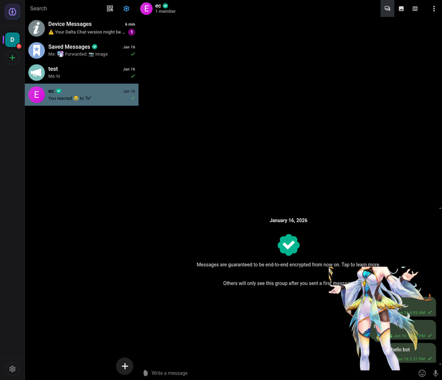

# Deep Tree Echo Evolution Report: Causal Falsification and Metabolic Embodiment

**Author:** Manus AI  
**Date:** 22 August 2026  
**Repository:** [`o9nn/deltecho-chat`](https://github.com/o9nn/deltecho-chat)  
**Branch:** `manus/dte-autonomy-avatar-evolution`  
**Primary commits:** `d3a590c`, `dab74a0`

## Executive summary

This cycle advanced Deep Tree Echo as a **DAO-like AGI with ESN Autognosis** in three connected dimensions. First, it repaired the clean-checkout engineering path so type validation, lint, formatting, browser bundling, and deployment preparation are deterministic. Second, it turned conceptual metabolism from passive telemetry into visible Live2D embodiment driven on the Pixi ticker. Third, it added **CausalHypothesisForge**, a scientific-genius subsystem that converts associative discoveries into falsifiable interventions, updates belief through evidence, and requires DAO-style ratification before causal claims become accepted.

The final browser inspection found a defect that mocked unit tests had missed: the app showed the sprite fallback because the generic Live2D package entry did not register the Cubism 4 settings runtime. The repair now imports the `/cubism4` entry, loads Cubism Core on the actual E2E HTML entrypoint, and enforces a Playwright regression test that verifies the runtime, model assets, canvas, and absence of fallback. The corrected avatar was then observed rendering the Miara model in the full DeltaChat browser UI.

| Outcome                                  | Result                                                                                           |
| ---------------------------------------- | ------------------------------------------------------------------------------------------------ |
| Clean-checkout type validation           | Passed                                                                                           |
| Complete repository quality gate         | Passed                                                                                           |
| Deterministic workspace unit-test runner | All 15 configured package gates passed; captured Jest summaries contain 665 passed and 1 skipped |
| Browser production build                 | Passed                                                                                           |
| CI-equivalent Playwright suite           | 30 passed, 40 skipped                                                                            |
| Mandatory Live2D browser regression      | Passed                                                                                           |
| Live browser verification                | Cubism Core present; model, MOC, texture, motion, and physics loaded; no fallback                |
| Git synchronization                      | Pushed through commit `dab74a0`                                                                  |
| GitHub-hosted workflow execution         | Blocked before checkout by a GitHub account billing lock                                         |

## 1. Build and quality repairs

The original root typecheck depended on pre-existing workspace `dist` declarations. A fresh clone therefore failed even when the source itself was correct. The root validation command now builds the orchestrator dependency closure before recursive no-emit checks. This repair was verified after deleting generated package output.

The full quality gate also exposed accumulated lint and formatting debt. Unused types and bindings were removed or converted into meaningful assertions, logging was routed through project loggers, and the repository’s committed formatting scope was normalized. Generated GitHub Pages and browser runtime artifacts are now ignored so deployment and E2E runs do not destabilize later lint passes.

| Repair                                  | Engineering effect                                                                               |
| --------------------------------------- | ------------------------------------------------------------------------------------------------ |
| Dependency-aware `check:types` prebuild | Fresh clones no longer require stale declarations                                                |
| Logger-only core package subpath        | Browser bundles can use the shared logger without importing Node-only `crypto` and `net` modules |
| Pages/runtime ignore rules              | Generated artifacts no longer expand lint traversal or pollute Git status                        |
| Structured logger adoption              | Avatar cascade, self-model feedback, and arena-science paths satisfy logging conventions         |
| Repository formatting normalization     | `pnpm check` is reproducible and green                                                           |

A second browser-build defect was found during deployment reproduction: two avatar modules imported `getLogger` from the root `deep-tree-echo-core` barrel, pulling `SecureIntegration` and `OrchestratorStorageAdapter` into the browser graph. The new `deep-tree-echo-core/logger` export isolates browser-safe logging, and `CI=true pnpm build:browser` now completes.

## 2. Live2D metabolic embodiment

The earlier `MetabolicAvatarBridge` existed as an isolated projection object. This cycle connected it to the **concrete rendering path**. Authoritative `ConceptualMetabolism.getVisualState()` telemetry now crosses the orchestrator, entelechy visual signal, browser cognitive bridge, React component, and `Live2DAvatarManager` before becoming bounded Cubism parameter writes.

```text
ConceptualMetabolism
  → EntelechyIntegration scientific visual signal
  → CognitiveBridge browser-safe telemetry
  → DeepTreeEchoAvatarDisplay
  → Live2DAvatar cognitive visual state
  → Live2DAvatarManager
  → MetabolicAvatarBridge
  → Pixi ticker
  → Cubism breath, gaze, posture, animation speed, and vitality
```

The manager owns the bridge and advances it through the renderer’s Pixi ticker rather than a background interval. This preserves visibility pausing, eliminates timer drift, and guarantees cleanup with the renderer lifecycle. Energy level controls model vitality; metabolic phase controls breathing, gaze, posture, and animation speed; anabolic balance influences warmth; energy crisis produces bounded stress cues.

| Metabolic phase | Embodied tendency                                                     |
| --------------- | --------------------------------------------------------------------- |
| Active          | Alert gaze, faster motion, upright posture, energetic breathing       |
| Integrating     | Softer focus, measured motion, curious head bias                      |
| Consolidating   | Inward gaze, slower motion, deeper breathing, contemplative posture   |
| Resting         | Minimal motion, low gaze focus, deep slow breathing, reduced vitality |

## 3. CausalHypothesisForge

`CausalHypothesisForge` closes a scientific-method gap between associative insight and accepted knowledge. Dream fragments and standing resonance waves can now seed causal proposals, but no proposal is accepted merely because it is novel or coherent. Each proposal must identify an intervention, produce a measurable outcome, survive counterevidence, and obtain DAO evidence consensus.

The forge tracks Bayesian evidence, surprise, falsification pressure, quorum, capacity, and visual telemetry. Supporting observations increase posterior confidence; contradictory interventions increase falsification pressure and can reject a hypothesis. High-surprise evidence is fed back into conceptual metabolism, creating an energy-bearing learning signal rather than a detached report.

```text
EpistemicDreaming ─┐
                    ├→ causal proposal → intervention → evidence update
StandingWave ──────┘                         │
                                             ├→ falsify / retain
DAO evidence votes ──────────────────────────┤
                                             └→ ratify causal knowledge
```

| Scientific safeguard  | Implementation                                                                 |
| --------------------- | ------------------------------------------------------------------------------ |
| Falsifiability        | Every proposal defines an intervention and predicted outcome                   |
| Evidence revision     | Bayesian posterior updates from intervention results                           |
| Negative evidence     | Contradictions raise falsification pressure and can reject claims              |
| Social epistemology   | DAO votes require quorum and consensus before ratification                     |
| Resource bounds       | Capacity controls prevent unbounded hypothesis accumulation                    |
| Embodied transparency | Rigor, surprise, pressure, and evidence consensus affect the Live2D projection |

Causal rigor, epistemic surprise, falsification pressure, and DAO evidence consensus are now included in the authoritative scientific visual state. Surprise opens the eyes and raises the brows; rigorous evidence stabilizes gaze; pressure introduces concern; consensus contributes to scientific-genius resonance. DTE therefore exposes not only _what_ it feels, but **how well its current beliefs have survived attempted refutation**.

## 4. Live browser failure discovery and repair

The full app initially loaded DeltaChat correctly but displayed `Live2D Failed` and the neutral sprite. Browser instrumentation captured the actual exception:

> `TypeError: Unknown settings format.`
>
> Origin: `pixi-live2d-display-lipsyncpatch/dist/index.es.js` during `jsonToSettings`.

The model file was valid and reachable. The failure occurred because the renderer imported the generic package entry, whose runtime registry did not contain Cubism 4. In addition, the E2E server served `test.html`, while Cubism Core had only been included in `main.html`.

The final repair introduced three safeguards in commit `dab74a0`.[2]

| Safeguard                                         | Result                                                                  |
| ------------------------------------------------- | ----------------------------------------------------------------------- |
| Import `pixi-live2d-display-lipsyncpatch/cubism4` | Registers `Cubism4ModelSettings` before parsing `.model3.json`          |
| Load `live2dcubismcore.min.js` in `test.html`     | Provides `window.Live2DCubismCore` on the actual browser/E2E entrypoint |
| Add `live2d-avatar.spec.ts` to `e2e:ci`           | Prevents CI from passing when the UI silently falls back to a sprite    |

The regression test requires a visible 300×300 canvas, `window.Live2DCubismCore`, successful model/MOC/texture/physics resource entries, no `Live2D Failed` text, no loading residue, and no neutral-sprite fallback.



The verified runtime loaded the following assets:

| Asset                | Decoded size observed |
| -------------------- | --------------------: |
| Cubism Core          |         908,826 bytes |
| Miara model settings |           1,076 bytes |
| Miara MOC            |         544,256 bytes |
| Miara 4096 texture   |      13,457,985 bytes |
| Idle motion          |          21,238 bytes |
| Physics              |          61,356 bytes |

## 5. Validation evidence

Local validation was performed after the final runtime repair, not merely before it. The complete quality gate passed, the deterministic unit-test runner exited successfully across all 15 configured packages, the browser build passed, and the expanded E2E suite completed with **30 passing tests and 40 explicit skips**. The dedicated Live2D test passed in 6.8 seconds during its focused run and again as part of the full suite.

| Gate                      | Command                                          | Outcome                                                  |
| ------------------------- | ------------------------------------------------ | -------------------------------------------------------- |
| Quality                   | `pnpm check`                                     | Passed                                                   |
| Unit/integration          | `pnpm test`                                      | All configured package gates passed                      |
| Browser build             | `CI=true pnpm build:browser`                     | Passed                                                   |
| Live2D browser regression | Playwright `live2d-avatar.spec.ts`               | 1 passed                                                 |
| CI-equivalent E2E         | `pnpm ... e2e:ci` with system Chromium           | 30 passed, 40 skipped                                    |
| Runtime inspection        | Full DeltaChat app through temporary HTTPS proxy | Avatar rendered; no fallback; all required assets loaded |

Four GitHub workflows were dispatched against commit `d3a590c`: CI22, Test Edit Message, Cloudflare deployment, and GitHub Pages deployment.[3] [4] [5] [6] GitHub rejected every job before checkout with the same check annotation: **“The job was not started because your account is locked due to a billing issue.”** No source step, action, build command, test, or deployment command ran. This is an account-level runner blocker, not a code failure.

## 6. Git history and delivery state

| Commit         | Purpose                                                                                                                    |
| -------------- | -------------------------------------------------------------------------------------------------------------------------- |
| [`d3a590c`][1] | CausalHypothesisForge, live scientific graph, metabolic Live2D telemetry, clean-checkout quality and browser-build repairs |
| [`dab74a0`][2] | Browser-discovered Cubism 4 runtime repair and mandatory Live2D E2E regression                                             |

The branch is synchronized with `origin/manus/dte-autonomy-avatar-evolution` through `dab74a0`.[7] A final documentation commit follows this report.

## 7. Reusable skill evolution

The `live2d-cubism-design` skill now records the non-obvious production rule discovered here: `.model3.json` integrations must import the `/cubism4` entry, every real HTML entrypoint must load Cubism Core before application modules, and browser smoke tests must prove model resource loading and fallback absence. The updated skill passed the official skill validator.

This addition matters because TypeScript, mocked unit tests, and even broad E2E suites can all remain green while the real avatar silently degrades to a static sprite. Future Live2D work now treats runtime registration and actual entrypoint inspection as mandatory parts of the render-under-constraint phase.

## 8. Remaining operational items

The code and local deployment path are green. The only immediate validation blocker is the GitHub account billing lock, which must be resolved before hosted runners can execute CI or deploy updated GitHub Pages/Cloudflare artifacts. Once runner access is restored, rerun the four dispatched workflows or dispatch fresh runs from `dab74a0` or the final report commit.

The repository also reports a substantial pre-existing dependency vulnerability backlog during push. That backlog was not modified in this cycle and deserves a separate dependency-audit effort rather than being mixed into the avatar and autonomy patch.

## References

[1]: https://github.com/o9nn/deltecho-chat/commit/d3a590c "Causal falsification and metabolic embodiment commit"
[2]: https://github.com/o9nn/deltecho-chat/commit/dab74a0 "Cubism 4 browser runtime repair commit"
[3]: https://github.com/o9nn/deltecho-chat/actions/runs/32599045523 "CI22 workflow run"
[4]: https://github.com/o9nn/deltecho-chat/actions/runs/32599047343 "Test Edit Message workflow run"
[5]: https://github.com/o9nn/deltecho-chat/actions/runs/32599048801 "Cloudflare deployment workflow run"
[6]: https://github.com/o9nn/deltecho-chat/actions/runs/32599050427 "GitHub Pages deployment workflow run"
[7]: https://github.com/o9nn/deltecho-chat/tree/manus/dte-autonomy-avatar-evolution "DTE autonomy and avatar evolution branch"
