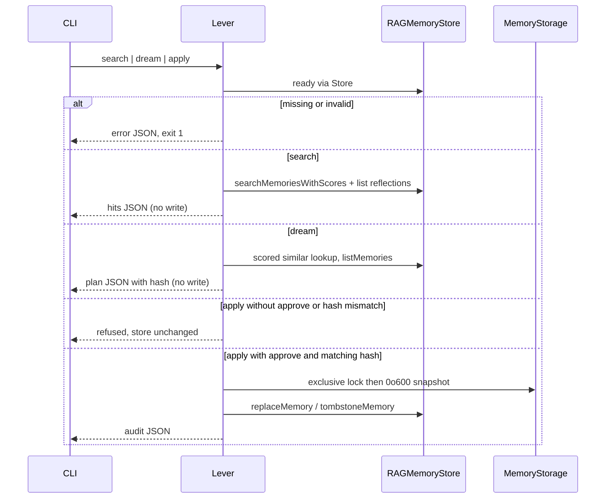
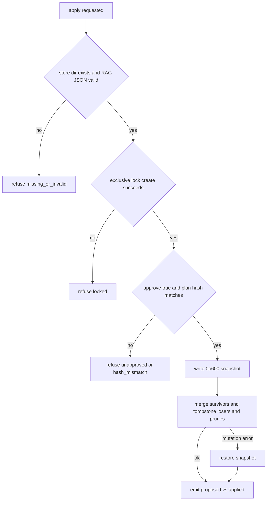

# Deep Tree Echo Memory Lever - Plan

## Goal Capsule

- **Objective:** Ship a rerunnable Deep Tree Echo memory lever: search memories like a context-loader, and plan/apply dream-style hygiene (merge near-duplicates, flag contradictions, prune stale) against local RAG keys `deepTreeEchoBotMemories` and `deepTreeEchoBotReflections`.
- **Authority:** This plan is the source of truth. Product behavior lives on R-IDs. Mechanism lives on KTDs. Units cite those IDs and do not restate them.
- **Execution profile:** Library in `deep-tree-echo-core` is the contract. CLI is a thin wrapper. Test-first for mutation and dry-run gates.
- **Stop conditions:** Stop if apply would mutate a second store ID space (`VectorMemoryStore`, companion `aiMemories`, HDM). Stop if Mem0 or a live Electron/Tauri session is required. Do not auto-resolve contradictions or hard-delete. A clean RAG plan is not hygiene of the autonomy vector arena.
- **Tail ownership:** `ce-work` implements U1–U5. Do not hook MCP, orchestrator scheduling, or frontend duplicates in this change.

---

## Product Contract

### Summary

Deep Tree Echo already stores conversation and reflection memories, and it already searches them. It does not have a deterministic, rerunnable tool that loads relevant context by query and type, then consolidates the store the way mem0 dream does. Journal "dream" paths write prose and leave the store unchanged. Mem0 is not in this repo and was unavailable this run. The product is a local lever operators and agents can rerun against on-disk RAG storage.

### Problem Frame

Hand hygiene of DTE memories is uncheckable. Near-duplicates accumulate, contradictions stay silent, and unique stale facts only fall off FIFO limits. This lever prunes only aged memories that are not pinned and are not the sole copy of a distinct noun set. Search exists (`RAGMemoryStore.searchMemories`) but has no topic/type packing for agent context. Consolidation exists only as journal stubs and episodic LLM summaries that do not merge or prune persisted RAG rows.

### Requirements

**Search (context-loader)**

- R1. Given a query and an explicit local store, the lever returns ranked conversation memories with id, timestamp, chatId, sender, text, and score. Equal scores sort by descending timestamp, then by id ascending. Recency-only hits with zero TF-IDF and embedding contribution are omitted.
- R2. Search accepts optional filters for chatId, sender, time window, and reflection type/aspect, and includes matching reflections in a separate list.
- R3. Search can pack results into a compact context block under a declared character budget, preferring higher-ranked hits. The budget truncates only that block. The hits array is not budget-filtered.
- R4. Search is read-only. It never creates a store, never writes keys, and never requires approval.

**Dream (plan)**

- R5. Dream produces a write-free plan listing merge groups, contradiction pairs, and prune candidates with memory ids, scores, and reasons. Dream and apply mutate conversation memories only. Reflections are search inputs (R2) and are not merge, contradiction, or prune inputs.
- R6. Near-duplicates are memories whose scored similar-memory value is at or above a configurable threshold (default 0.5).
- R7. A merge proposal keeps the newer memory as survivor, folds unique text from losers into the survivor, and archives losers as tombstones rather than dropping them from the plan.
- R8. Contradiction classification takes precedence over merge. A contradiction pair is two memories that share at least one noun and whose remaining tokens match a documented opposition table that includes {ECS, Vercel} plus a small negation set (not, never, no longer). Those pairs never enter a merge group. Apply never folds or tombstones those ids on the merge path. Both ids stay live. Dream never chooses a winner. AE3 passes by table hit.
- R9. Prune candidates are memories older than a configurable retention window (default 90 days) that are not pinned (`pinned !== true`) and are not the sole copy of a distinct noun set. Unique stale facts remain FIFO-only.
- R10. Dry-run is the default. A dry-run dream (no apply action) leaves storage bytes unchanged.

**Apply**

- R11. Apply without an explicit approve grant (`approve === true`) exits non-zero and leaves the store unchanged.
- R12. Apply with approve writes a pre-apply snapshot, then applies merges (survivor update + loser tombstones) and prune tombstones from the plan. If any mutation fails after snapshot, restore from that snapshot and do not leave a partial tombstone set.
- R13. Apply does not delete contradiction pairs.
- R14. A second dream on the post-apply store yields no new merge or prune of the same ids (idempotent on that store state).
- R15. Apply refuses if the store directory path is missing, a RAG JSON key file is missing or not valid JSON, or exclusive create of a sibling `.lock` fails.

**Contract and safety**

- R16. Library and CLI expose the same operations and the same JSON result shape.
- R17. Missing store path is an error. The lever does not mkdir a new empty memory store. `FileSystemStorage` opens used by the lever pass `createIfMissing: false`.
- R18. Logging uses `getLogger`. CLI machine output is one JSON object on stdout. All logger output goes to stderr, including if that requires a stderr wrapper around `getLogger`.
- R19. Conversation text, packed context blocks, sender, and chatId are sensitive. `getLogger` may record ids, counts, reason codes, and paths only — never memory or plan body text. Search/dream/apply DTOs go only to stdout.
- R20. When `vectorMemoryStore_memories` exists in the same directory, search and dream set `unused_stores: ["vectorMemoryStore"]`. A clean RAG plan is not hygiene of the autonomy arena.
- R21. The live FIFO `memoryLimit` counts only non-tombstoned memories. Tombstones stay in the store and do not evict live rows.
- R22. Apply succeeds only when `approve === true` and the supplied plan hash matches a recomputation over that plan object. Standalone apply reads plan JSON from `--plan` or stdin. `dream --apply --approve` computes the plan in-process, stamps the hash, and applies it. `--approve` is a valueless CLI flag with no environment-variable alias.

### Actors

- A1. Operator or coding agent running the CLI against a filesystem store.
- A2. Test/runtime caller using the library with `InMemoryStorage` or `FileSystemStorage`.
- A3. Companion identity represented by persisted RAG memories (not a UI user).

### Key Flows

- F1. Context load
  - **Trigger:** A1 or A2 calls search with a query.
  - **Actors:** A1, A2
  - **Steps:** Open existing store. Enable reads. Rank memories per R1–R3. Emit JSON. Do not write.
  - **Covered by:** R1, R2, R3, R4, R17, R20
- F2. Dream dry-run
  - **Trigger:** A1 or A2 calls dream without an apply action.
  - **Steps:** Open existing store. Build merge/contradiction/prune plan. Emit JSON. Do not write.
  - **Covered by:** R5, R6, R7, R8, R9, R10
- F3. Gated apply
  - **Trigger:** A1 runs `apply --approve --plan <file|->` or `dream --apply --approve`.
  - **Steps:** Take exclusive lock. Re-read store. Refuse on lock/invalid/missing/hash mismatch. Snapshot at 0o600. Apply merges and prunes. Restore on mutation failure. Emit audit of proposed vs applied including plan hash.
  - **Covered by:** R11, R12, R13, R14, R15, R22
- F4. Refusal
  - **Trigger:** Apply without approve, missing path, bad JSON, lock held, or plan-hash mismatch.
  - **Steps:** Non-zero exit. Unchanged store. JSON error with reason code.
  - **Covered by:** R11, R15, R17, R22

### Acceptance Examples

- AE1. Covers R1, R4. Given two stored memories "TypeScript programming" and "grocery list", when search query is "TypeScript", then only the programming memory is in the ranked hits and storage is unchanged.
- AE2. Covers R5, R6, R7, R10. Given two near-duplicate memories about the same fact with similarity ≥ 0.5, when dream runs dry, then the plan contains one merge group, stdout lists both ids, and storage bytes are unchanged.
- AE3. Covers R8, R13. Given "Deploy to ECS" and "Deploy to Vercel" as opposing facts, when dream then apply with approve, then both ids remain as live memories, the plan lists a contradiction pair, and neither id is merged.
- AE4. Covers R11. Given a valid store and a non-empty dream plan, when apply runs without approve, then exit is non-zero and the store is byte-identical.
- AE5. Covers R12, R14. Given AE2's store, when apply runs with approve and dream runs again, then losers are tombstoned, the survivor remains searchable, and the second plan has no merge of those ids.
- AE6. Covers R15, R17. Given a path that does not exist, when search or dream runs, then the lever errors with a missing-store reason and creates no files.

### Success Criteria

- `pnpm --filter=deep-tree-echo-core test` passes including new lever tests.
- CLI search and dream dry-run can be rerun against a fixture directory with identical JSON under R1's tie-break.
- Apply is possible only with approve plus matching plan hash, and a reviewer can rerun the same tests to prove dry-run vs apply.

### Scope Boundaries

**In scope**

- `RAGMemoryStore` conversation and reflection keys via injectable `MemoryStorage`.
- Dream and apply mutate conversation memories only.
- Library in `packages/core/src/memory/` plus CLI under `bin/`.
- Heuristic dream (similarity, closed opposition table, age). No LLM required.

**Deferred for later**

- `VectorMemoryStore` / embedding-service backend (same U1 port later).
- Pin/unpin CLI command (v1 preserves optional `pinned` on JSON records only).
- Restore-from-snapshot as a first-class command.
- HyperDimensionalMemory dual-index and IntegratedMemorySystem id linkage fix.
- Frontend `DeepTreeEchoBot/RAGMemoryStore` and `AICompanionHub` `aiMemories`.
- MCP tool wrappers and orchestrator `runConsolidation` scheduling.
- LLM-assisted merge text.
- Hard-delete apply class.

**Outside this product's identity**

- Mem0 cloud as source of truth.
- Silent irreversible delete.
- Auto-resolving contradictions.
- TTY-only confirmation as the sole apply path.
- Unifying or deleting the frontend store forks.

### Sources

- `packages/core/src/memory/RAGMemoryStore.ts` — search, `findSimilarMemories`, keys `deepTreeEchoBotMemories` / `deepTreeEchoBotReflections`.
- `packages/core/src/memory/VectorMemoryStore.ts` — `searchMemoriesWithScores` and `ready()` patterns to mirror.
- `packages/core/src/memory/storage.ts`, `packages/core/src/memory/FileSystemStorage.ts` — adapter and atomic writes. `initialize` currently always mkdir; lever opens must not.
- `packages/core/src/memory/__tests__/RAGMemoryStore.test.ts` — enable, store, search, `InMemoryStorage` wait-for-load pattern.
- `packages/core/src/utils/logger.ts` — info/debug currently go to `console.log`; CLI must wrap to stderr.
- `bin/deltecho-bot.ts` — `ts-node` CLI pattern.
- `RAGBOT_ROADMAP.md` — consolidation algorithms still unchecked.
- Journal dream in `ProactiveActionKernel` / `InternalJournalManager` is not this product (does not mutate RAG).

---

## Planning Contract

### Key Technical Decisions

- KTD1. Library is the source of truth. CLI wraps the library. MCP and orchestrator call the library later, not the reverse.
- KTD2. V1 mutates `RAGMemoryStore` only (`deepTreeEchoBotMemories` / `deepTreeEchoBotReflections`), with caller-injected `MemoryStorage`. U1 list/get/replace/tombstone is a store port RAG implements now. Vector keys in the same directory trigger R20 and are never applied. Chosen over a unified two-store apply: those stores use different keys and incompatible embeddings.
- KTD3. Add list and mutation primitives on `RAGMemoryStore` (`listMemories`, `listReflections`, `getMemory`, `replaceMemory`, `tombstoneMemory`, `ready`, `searchMemoriesWithScores`, scored similar-memory lookup) instead of rewriting JSON behind the store. Chosen so IDF cache, embeddings, and enable-flag behavior stay consistent with existing save paths.
- KTD4. Tombstone is a structured marker on conversation `Memory` only (archived, not removed from the array). Search, similarity, chat getters, and `calculateIDF` skip tombstones. FIFO `memoryLimit` trim excludes tombstoned rows per R21. Chosen over hard-delete so apply is reversible from the snapshot and R7/R12 stay auditable without evicting live identity.
- KTD5. Dream merge uses scored similar-memory lookup (default threshold 0.5). Contradiction detection uses R8's closed opposition table, not `QuantumBeliefPropagation` and not open polarity inference. Chosen because QBP operates on beliefs, not RAG rows.
- KTD6. Apply requires an apply action, `approve === true`, and a matching plan hash in the same invocation (CLI flags or library options). No TTY prompt. No env alias for approve. Chosen so unattended agents can refuse by default and grant non-interactively on a specific plan.
- KTD7. Snapshot files in the storage directory are `deepTreeEchoBotMemories.json.bak-<timestamp>` and `deepTreeEchoBotReflections.json.bak-<timestamp>`, created with mode 0o600 while the exclusive apply lock is held, before any replace or tombstone. InMemory tests clone the storage map. Do not write snapshots to `os.tmpdir()`.
- KTD8. Pass the store directory with `--storage-path`. If the flag is omitted, honor `DELTECHO_AUTONOMY_STORAGE_PATH` only when that directory already exists. Never create the directory. If both are omitted, or the resolved path does not exist, fail as a missing-path error.
- KTD9. Near-duplicate merge rewrites the survivor in place and tombstones sources. It does not add a new reflection as the only merge artifact. Chosen so search still returns one live fact.
- KTD10. `FileSystemStorageConfig.createIfMissing` defaults true for existing autonomy-pipeline callers. MemoryLever and CLI pass `false`. `getMemory` / `replaceMemory` / `tombstoneMemory` throw on unknown id. JSON.parse failure of a RAG key fails `ready()` instead of emptying the array.

### High-Level Technical Design

Library owns the protocol. CLI is argv → library → JSON stdout.

Apply gates:

### Assumptions

- Mem0 remains unauthenticated. V1 mutates RAG keys only. Autonomy `VectorMemoryStore` is durable but out of mutation scope; R20 makes that visible.
- R8's closed table is enough for v1 contradiction flags. AE3 is a table hit.
- Retention default of 90 days matches the attached dream skill's session_state/compact_summary window. Optional `pinned` defaults false on existing rows.
- Enabling the store for lever reads (`setEnabled(true)` in-process after `ready()`) does not persist a new `deepTreeEchoBotMemoryEnabled` value (core RAG does not save the flag).
- Operators point `--storage-path` at a directory that already holds RAG JSON keys (or tests inject `InMemoryStorage`).
- OS file ownership of the storage directory is the authorization model for v1.

### Implementation Constraints

- No `console.log` in new code. Use `getLogger("deep-tree-echo-core/memory/MemoryLever")` with R18/R19.
- Do not import Node `fs` in the library body except through `FileSystemStorage` (including the new `createIfMissing` flag).
- Do not change frontend store copies.
- Do not require network or embedding providers for search or dream. U1 embedding refresh stays on RAGMemoryStore's local hash projection.
- Keep `pnpm --filter=deep-tree-echo-core test` green.

### Sequencing

U1 store primitives → U2 search lever → U3 dream planner → U4 gated apply → U5 CLI.

### Risks

- Store sprawl: R20 `unused_stores` when vector keys are present but unused.
- Corrupt companion memory on a bad merge: snapshot plus tombstones plus dry-run default plus plan-hash bind.
- IDF corpus including tombstones: U1 excludes tombstones from `calculateIDF`.
- Partial apply: R12 restore-from-snapshot.
- Logger stdout mixing: U5 stderr wrapper.

---

## Implementation Units

### U1. RAGMemoryStore list and tombstone primitives

- **Goal:** Expose list, get, replace, tombstone, ready, and scored-search operations so later units do not rewrite storage JSON behind the store.
- **Requirements:** R1, R9, R12, R15, R17, R21
- **Dependencies:** none
- **Files:** `packages/core/src/memory/RAGMemoryStore.ts`, `packages/core/src/memory/FileSystemStorage.ts`, `packages/core/src/memory/index.ts`, `packages/core/src/memory/__tests__/RAGMemoryStore.test.ts`, `packages/core/src/memory/__tests__/FileSystemStorage.test.ts`
- **Approach:**
  1. Add optional `pinned?: boolean` (default false) and tombstone field on conversation `Memory` only. Search, `findSimilarMemories`, chat getters, and `calculateIDF` skip tombstones.
  2. Add `listMemories` / `listReflections`, `getMemory`, `replaceMemory`, `tombstoneMemory`, `ready()`, `searchMemoriesWithScores`, and scored similar-memory lookup. Mirror `VectorMemoryStore.ready` and `searchMemoriesWithScores`.
  3. Persist through the existing save path. FIFO trim counts only live rows (R21). Invalidate IDF cache the same way store/clear already does.
  4. `getMemory` / `replaceMemory` / `tombstoneMemory` throw on unknown id. Do not create rows. JSON.parse failure of either RAG key fails `ready()` instead of replacing the array with []. Await `ready()` before `setEnabled(true)`.
  5. Add `createIfMissing?: boolean` to `FileSystemStorageConfig`, default true. When false, skip mkdir and surface ENOENT as missing store.
- **Patterns to follow:** `storeMemory` enable-guard, `VectorMemoryStore.ready`, `InMemoryStorage` tests.
- **Test scenarios:**
  - Enabled store: `listMemories` returns stored rows; search omits tombstoned ids; IDF after tombstone does not use loser tokens.
  - `replaceMemory` updates text and refreshes embedding; subsequent search uses new text.
  - `tombstoneMemory` on unknown id throws and does not throw away other rows.
  - Disabled store: mutations no-op or error consistently with `storeMemory`.
  - `ready()` rejects invalid JSON. `createIfMissing: false` does not mkdir.
  - FIFO: storing past limit evicts oldest live rows and never evicts to make room for a tombstone.
- **Verification:** Existing RAG tests still pass. New cases cover skip-tombstones, scored search, ready, and cache-safe replace.

### U2. Context-loader search API

- **Goal:** Rank and pack relevant memories for a query without writing.
- **Requirements:** R1, R2, R3, R4, R16, R17, R18, R19, R20
- **Dependencies:** U1
- **Files:** `packages/core/src/memory/MemoryLever.ts`, `packages/core/src/memory/index.ts`, `packages/core/src/memory/__tests__/MemoryLever.test.ts`
- **Approach:**
  1. Construct `MemoryLever` with an existing `RAGMemoryStore` (caller awaits `ready()` and enables it).
  2. `search` uses `searchMemoriesWithScores` plus optional `limit` and in-process filters (chatId, sender, from/to timestamp) and filtered `listReflections`. Drop recency-only zero-contribution hits.
  3. Packer truncates only the formatted context block to `budgetChars`, dropping lowest-rank memories from that block first. The hits array is not budget-filtered.
  4. Library search must not call `save`. Logs record ids/counts only (R19).
- **Patterns to follow:** `VectorMemoryStore.searchMemoriesWithScores`; `getLogger` with R19.
- **Test scenarios:**
  - Covers AE1. Keyword query returns the matching memory with id and score; grocery-list recency-only hit is omitted; storage adapter save is not called.
  - Filter chatId excludes the other chat's hit.
  - Filter sender excludes the other sender.
  - from/to window excludes out-of-range hits.
  - Reflection type/aspect includes matching reflections and excludes the rest.
  - Limit 1 returns only the top hit.
  - Budget 80 characters: packed block keeps the top hit and omits the lower-ranked second hit; hits array still includes both.
  - Empty store returns empty lists, not an error.
  - Equal scores follow R1 tie-break.
- **Verification:** Tests spy or wrap `MemoryStorage.save` and assert zero calls on search.

### U3. Dream planner (write-free)

- **Goal:** Emit merge, contradiction, and prune proposals without mutating the store.
- **Requirements:** R5, R6, R7, R8, R9, R10, R22
- **Dependencies:** U1, U2
- **Files:** `packages/core/src/memory/MemoryLever.ts`, `packages/core/src/memory/__tests__/MemoryLever.test.ts`
- **Approach:**
  1. Run contradiction detection first using R8's closed table. Remove those pairs from merge grouping.
  2. Pairwise scored similar-memory lookup above threshold on remaining live conversation memories; greedy groups; survivor is max timestamp then longer text.
  3. Prune: timestamp older than retention, `pinned !== true`, not unique-noun-only, not already a merge loser, conversation memories only.
  4. Plan object includes a stable hash of sorted ids+actions. U4 verifies that hash.
- **Patterns to follow:** Comment on similar-memory clustering. Do not call autonomy LLM consolidation.
- **Test scenarios:**
  - Covers AE2. Two paraphrases of one fact produce one merge group; `save` not called.
  - Covers AE3. ECS vs Vercel pair is a contradiction, not a merge.
  - Memory newer than 90 days is not pruned; an old generic duplicate is; an old pinned memory is not a prune candidate.
  - Tombstoned memories are ignored as inputs.
- **Verification:** Fixture stores produce deterministic plan JSON (sorted groups) and a stable hash.

### U4. Gated apply with snapshot

- **Goal:** Apply a dream plan only with approve and matching hash, after snapshot, without hard-delete or contradiction resolution.
- **Requirements:** R11, R12, R13, R14, R15, R22
- **Dependencies:** U1, U3
- **Files:** `packages/core/src/memory/MemoryLever.ts`, `packages/core/src/memory/__tests__/MemoryLever.test.ts`
- **Approach:**
  1. `apply(plan, { approve, expectedHash })` refuses when `approve` is not strictly true or the recomputed hash mismatches.
  2. Injected exclusive-lock hook: exclusive create (`wx` / `O_EXCL` or `flock`) of sibling `.lock` mode 0o600, taken before snapshot, released after mutate or on process exit. Mere file existence is not the lock. Throw `locked` if exclusive create fails. `beforeMutate` throw leaves store unchanged.
  3. Snapshot via injected `snapshot(): Promise<void>`. Snapshot throw behaves like `beforeMutate` throw (no mutations).
  4. Apply merges then prunes. Skip contradiction ids. On any `replaceMemory` / `tombstoneMemory` failure, restore from snapshot. Return audit { proposed, applied, skipped, hash }.
  5. Re-dream after apply has empty merge/prune for those ids.
- **Execution note:** Implement refuse-without-approve as a failing test before the mutation path.
- **Test scenarios:**
  - Covers AE4. Apply without approve: error code `unapproved`, store unchanged.
  - Apply with approve but wrong hash: `hash_mismatch`, store unchanged.
  - Covers AE5. Apply with approve and matching hash: survivor text contains unique loser clauses; losers tombstoned; second dream has no those-id merges.
  - Contradiction ids remain listable as live.
  - `beforeMutate` throw leaves store unchanged (no partial apply).
  - Post-snapshot mutation throw restores snapshot bytes.
- **Verification:** Byte or JSON equality helpers on `InMemoryStorage` before/after refusal.

### U5. CLI wrapper and filesystem open

- **Goal:** `bin/dte-memory-lever.ts` runs search, dream, and apply against an existing directory, with JSON stdout.
- **Requirements:** R16, R17, R18, R19, R20, R22; F1–F4
- **Dependencies:** U2, U3, U4
- **Files:** `bin/dte-memory-lever.ts`, `package.json`, `packages/core/src/memory/__tests__/MemoryLever.fs.test.ts`
- **Approach:**
  1. Shebang and `ts-node` like `bin/deltecho-bot.ts`. Commands: `search`, `dream`, `apply`.
  2. Resolve path per KTD8. Open `FileSystemStorage` with `createIfMissing: false`. Await `ready()`. `setEnabled(true)` in-process. Do not persist the enabled flag.
  3. Flags: `--query`, `--limit`, `--budget-chars`, `--threshold`, `--retention-days`, `--chat-id`, `--sender`, `--from`, `--to`, reflection type/aspect, `--plan`, `--apply`, `--approve`. Map `--limit` and filters through to library search. `dream --apply --approve` computes then applies. `apply --approve --plan <file|->` reads plan JSON from `--plan` or stdin. Payload is the same DTO as library `apply`.
  4. Exclusive lock then 0o600 snapshots per KTD7. Stderr-only logger wrapper. DTOs never logged.
  5. Add `pnpm memory:lever` script. Integration test uses a unique directory under `os.tmpdir()` for the live store; snapshots stay inside that store dir.
- **Patterns to follow:** `FileSystemStorage` atomic write; R18/R19 logging.
- **Test scenarios:**
  - Covers AE6. Missing directory: non-zero, no files created.
  - Temp dir with two memories: `search` JSON matches library `search` on the same store, including chatId filter.
  - Dream dry-run: files byte-identical; apply without `--approve` identical; `dream --apply --approve` changes files and writes 0o600 snapshots.
  - Vector key present: JSON includes `unused_stores`.
- **Verification:** Core test suite includes the fs integration file. Script is documented in the CLI header comment only (no extra markdown doc required).

---

## Verification Contract

| Gate | Command | Applies to | Done signal |
| --- | --- | --- | --- |
| Unit + integration | `pnpm --filter=deep-tree-echo-core test` | U1–U5 | All tests pass, including `MemoryLever`, RAG primitives, and FileSystemStorage `createIfMissing` |
| Types | `pnpm --filter=deep-tree-echo-core check:types` | U1–U5 | `tsc --noEmit` clean |
| Log convention | `pnpm check:log-conventions` if new files use logging | U2, U5 | No raw console in lever/CLI |
| Behavior | Fixture AE1–AE6 encoded as tests | U2–U5 | Dry-run vs apply vs contradiction vs missing-path proven |

Do not require `pnpm e2e` or Electron. This change has no UI.

---

## Definition of Done

**Global**

- R1–R22 are each cited by at least one unit that landed.
- Library and CLI share DTOs. No second scoring implementation in the CLI.
- Abandoned experimental helpers are not left in `packages/core/src/memory/`.
- Frontend, orchestrator scheduler, VectorMemoryStore mutation, and Mem0 remain untouched.

**Per unit**

- U1: list/replace/tombstone/ready/scored-search exist; search and IDF skip tombstones; FIFO ignores tombstones; `createIfMissing: false` does not mkdir.
- U2: search tests prove read-only packing, filters, limit, AE1 exclusive hits, and tie-break.
- U3: dream tests prove merge vs contradiction-first vs prune with no writes; pin skip; plan hash.
- U4: apply tests prove unapproved refusal, hash mismatch, snapshot restore, idempotent re-dream.
- U5: CLI fs test proves missing-path, approve gates, one-shot apply, and unused_stores.

---

## Appendix

Phase 1 skipped external web research: local RAG/search/storage patterns are established. Institutional `docs/solutions/` does not exist. Agent-native assessment: library+CLI now; MCP later; never TTY-only apply.

Doc review applied: contradiction-over-merge, RAG-only with `unused_stores`, scored search, `ready()` invalid JSON, `createIfMissing: false`, pin field, FIFO-excluding tombstones, closed opposition table, exclusive lock, 0o600 snapshots, plan-hash approve, stderr/PII logging, CLI argv contract, reflection-only-as-search.
