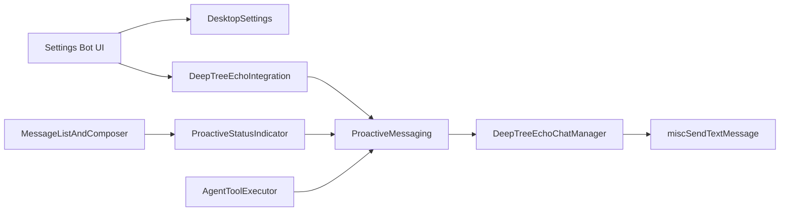
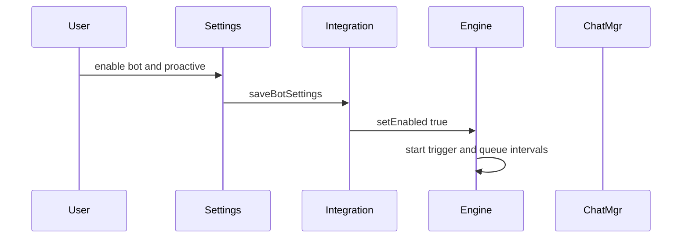
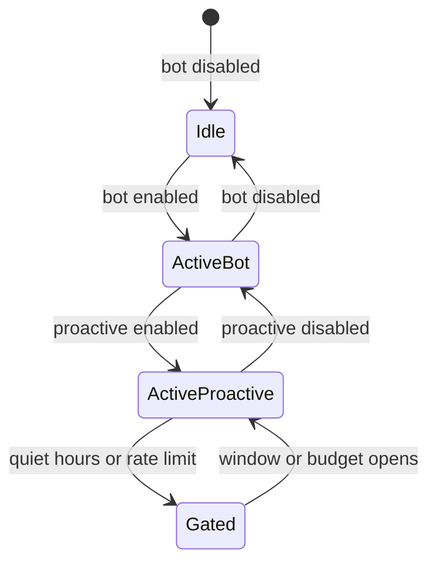

# Desktop DTE Proactive Messaging - Plan

## Goal Capsule

- **Objective:** Ship Deep Tree Echo proactive messaging in the Electron desktop app: the user can enable it, configure it, see it in chat, and DTE can send greetings and scheduled messages through the same gates.
- **Authority:** This plan is the source of truth. Product behavior lives on R-IDs. Mechanism lives on KTDs. Units cite those IDs and do not restate them.
- **Execution profile:** Close last-mile wiring of the existing renderer engine. Do not write a new desktop app. Test-first on engine bugs and persistence.
- **Stop conditions:** Stop if the work would rewrite the orchestrator daemon, invent a new MCP, merge the legacy React bot stack, persist the in-memory send queue across restarts, or change Live2D.
- **Tail ownership:** `ce-work` implements U1–U6. Electron is the production target. Browser-target tests are acceptable proof for the shared frontend path.

---

## Product Contract

### Summary

The desktop app already contains a proactive engine, a Settings proactive switch, trigger editors, and a chat status indicator. The Settings switch writes disk but does not sync the in-process engine. Trigger editors and the status indicator are not mounted. Default triggers cannot fire. Agent send tools bypass the gates. This plan closes that loop so a user who enables Deep Tree Echo Bot and Proactive Messaging gets working, controllable, bot-initiated messages.

### Problem Frame

Users cannot operate DTE as a desktop companion that starts conversations. The Settings page shows a proactive switch that writes disk only. Welcome-new-contact and silence check-in triggers are stubs. Quiet hours do not block overnight. Failed sends look successful. The in-app agent can send around those limits. The product looks complete in docs and is not shippable.

### Requirements

**Enable and policy**

- R1. Proactive messaging runs only when `deepTreeEchoBotEnabled` and `deepTreeEchoBotProactiveEnabled` are both true.
- R2. Changing either toggle updates the in-process engine in the same session. A restart is not required.
- R3. Quiet hours, hourly and daily rate limits, and respect-muted / respect-archived flags persist across restart and are loaded before the first trigger check.
- R4. Overnight quiet hours (default 22 to 08) block interval trigger checks and outbound sends. Same-day windows (for example 09 to 17) also block. One-shot event handlers may still enqueue. `processQueue` holds the send until the window opens.

**Triggers and welcome**

- R5. Settings expose live trigger list and policy controls. Edits persist as the full trigger set and replace in-memory triggers on load. Defaults are not appended a second time.
- R6. Welcome New Contact fires once per new contact id when that contact first appears, not on later `ContactsChanged` edits. Creating a 1:1 chat with an already-known contact is out of scope. Self-chat, device talk, broadcast, and mailing-list chats are excluded.
- R7. Check In After Silence uses each chat's last message timestamp (Unix seconds) against the trigger threshold in minutes. The default trigger stays disabled until the user enables it.
- R8. A welcomed-contact id set persists after a successful send (numeric message id). On first load, existing account contact ids are seeded as already-known so name-only edits do not welcome. A queued welcome lost on restart stays eligible.

**Delivery**

- R9. Queue processing treats a `null` send result as failure. It retries up to `maxAttempts`, then marks `failed`. Rate counters increment only on a numeric message id.
- R10. Agent tools `send_message` and `schedule_message` go through one gated `ProactiveMessaging` send/schedule API. When blocked they keep `{ success, output, metadata }` and set `metadata.reason` to `disabled`, `quiet_hours`, or `rate_limit`. Quiet hours and rate limits enqueue and set `metadata.queued`. They do not call `miscSendTextMessage` or `chatManager.scheduleMessage` directly.
- R11. Agent tools cannot enable or disable proactive messaging or rewrite policy or triggers.

**Surfaces**

- R12. When both flags in R1 are true, the open chat view shows a compact proactive status indicator for that chat's triggers and queued messages.
- R13. The status indicator can open the bot settings / trigger UI. Quick send and schedule from the indicator use the same gates as R10.
- R14. Reactive replies to incoming user messages stay on the existing bot reply path. Proactive gates apply only to bot-initiated traffic.

### Actors

- A1. Human operator of the Electron desktop app.
- A2. Deep Tree Echo in-app agent (`AgentToolExecutor`).
- A3. Proactive engine singleton in the renderer.

### Key Flows

- F1. Enable
  - **Trigger:** A1 turns on the bot, then proactive messaging.
  - **Actors:** A1, A3
  - **Steps:** Persist both flags. Init bot if needed. Sync `setEnabled`. Start trigger and queue intervals.
  - **Outcome:** Engine is live without restart.
- F2. Welcome
  - **Trigger:** A new contact id appears while F1 is live.
  - **Actors:** A3
  - **Steps:** Filter new-vs-seeded. Resolve an existing 1:1 chat via `getChatIdByContactId`. Skip if none. Skip self/device/broadcast. Queue welcome. Persist welcomed id only after a numeric send.
  - **Outcome:** One welcome send. Later contact edits do not re-fire. A restart before send leaves the contact eligible.
- F3. Configure
  - **Trigger:** A1 edits triggers or quiet hours / rate limits.
  - **Actors:** A1, A3
  - **Steps:** Update engine. Persist full trigger JSON and typed policy keys. Restart reloads the same set.
  - **Outcome:** No duplicate default triggers. Policy matches disk.
- F4. Status
  - **Trigger:** A1 opens a chat with R1 true.
  - **Actors:** A1, A3
  - **Steps:** Mount compact indicator. Show trigger and queue counts. Optional quick send through gates.
  - **Outcome:** Status is visible. Quick send uses R13 gates.
- F5. Agent send
  - **Trigger:** A2 calls `send_message` or `schedule_message`.
  - **Actors:** A2, A3
  - **Steps:** Evaluate R1, quiet hours, rate limits. Send now or queue. Return reason if blocked.
  - **Outcome:** No ungated RPC send.

### Acceptance Examples

- AE1. Bot off, proactive switch on: no `ContactsChanged` welcome and no queue send. Agent `send_message` returns `disabled`.
- AE2. Both flags on. New 1:1 contact created. Welcome is queued or sent once. A later name-only `ContactsChanged` does not queue another welcome.
- AE3. Quiet hours 22–08 at 23:00, same session: interval trigger check and queue process do not send. Agent `send_message` returns `metadata.reason: quiet_hours` and the text is queued. An app restart during quiet hours drops queued text; with persist-on-send the contact stays eligible for one later welcome.
- AE4. `chatManager.sendMessage` returns `null`: queued item is not `sent`. Rate counters do not increment.
- AE5. User edits a custom trigger and restarts: that trigger is present once. Default Welcome is not duplicated.
- AE6. Both flags on: open chat shows the status indicator. Quick send goes through the gated send API.
- AE7. Agent `schedule_message` appears in `proactiveMessaging.getQueuedMessages()`, not in `chatManager` scheduled-message storage.

### Success Criteria

A1 can enable DTE and proactive messaging, see status in chat, persist trigger and policy edits, receive one welcome for a new contact, and know that A2 cannot bypass quiet hours or rate limits.

### Scope Boundaries

**In scope**

- Renderer proactive engine, Settings bot UI, chat status indicator, desktop-settings persistence, agent send/schedule routing.

**Out of scope**

- New desktop shell, Tauri-only work, Discord/Telegram connectors, Live2D/avatar, Mem0, the memory-lever CLI, a new MCP server.

<!-- ce-section: work-relationships -->
### Work Relationships

This plan owns last-mile desktop proactive messaging on the existing Electron + frontend stack.

- **Depends on:** existing `ProactiveMessaging`, `DeepTreeEchoChatManager`, desktop settings types.
- **Enables later:** orchestrator 24/7 proactive loop as a separate plan; queue persistence across restart; agent trigger-proposal tools.
- **Independent of:** DTE memory lever (`docs/plans/2026-08-21-001-feat-dte-memory-lever-plan.md`).

### Deferred to Follow-Up Work

- Merge or disable the legacy `packages/frontend/src/components/chat/DeepTreeEchoBot.tsx` IncomingMsg path in `ScreenController.tsx`.
- Persist the in-memory send queue across app restart.
- Agent tools for cancel-queue and propose-trigger.
- `app_resume` event wiring from `onResumeFromSleep`.
- Implement `silence_duration` beyond last-message timestamp (for example unread-only or per-thread journals).

---

## Planning Contract

### Key Technical Decisions

- KTD1. Close last-mile wiring. Do not invent a second engine. Governs R1–R14.
- KTD2. Persist policy as typed `DesktopSettingsType` fields and persist the full trigger array in `deepTreeEchoBotProactiveTriggers`. Load replaces the in-memory map. Governs R3, R5.
- KTD3. Welcome once on new contact id only. Seed existing contact ids on first load. Resolve chat with `getChatIdByContactId` and skip if none. Confirm chat type via `getFullChatById` (`isSelfTalk`, `isDeviceTalk`, broadcast, mailing list). Persist `deepTreeEchoBotWelcomedContacts` only after a numeric send. Governs R6, R8.
- KTD4. Overnight quiet hours: when start > end, block if `hour >= start || hour < end`. Interval `checkTriggers` and outbound sends honor the window. One-shot `handleEvent` may enqueue. Governs R4.
- KTD5. `sendMessage` returning `null` is failure. Governs R9.
- KTD6. Keep `Settings/BotSettings.tsx` mounted for R1 switches so writes go through `SettingsStoreInstance.effect.setDesktopSetting` plus a callback into `setEnabled` / `initDeepTreeEchoBot` / `cleanupBot`. Host `DeepTreeEchoSettingsScreen` as a `Settings.tsx` back-stack sub-mode for triggers and policy. Governs R2, R5, R13.
- KTD7. Mount `ProactiveStatusIndicator` in `MessageListAndComposer` with the same enable gate as R1. Open settings via `openDialog(Settings, { initialMode: "bot_settings" })`. Governs R12, R13.
- KTD8. One gated send/schedule API on `ProactiveMessaging` evaluates R1, quiet hours, and rate limits, then sends, queues, or returns `metadata.reason`. Route agent tools and indicator quick send through that API only. `schedule_message` uses `queueMessage` with a future `scheduledTime`. Add read-only `get_proactive_status`. No policy-write tools. Governs R10, R11, R13.
- KTD9. Reactive incoming replies stay on `DeepTreeEchoBot.processMessage`. Governs R14.

### High-Level Technical Design

Component topology:

Enable and send sequence:

Runtime states:

### Assumptions

- A1 asked for a desktop app with DTE proactive messaging, not a new native shell. Electron remains the production target.
- “Etc” means the companion surfaces that make proactive messaging usable: settings, triggers, status, agent send gates.
- Default bot-off stays. Proactive default-on in `state.ts` stays inert until the bot is enabled.
- The in-memory send queue is process-lifetime only. AE3 queue-not-drop is same-session.
- Browser-target unit and component tests are sufficient automated proof. A live Electron click-through is recommended, not a merge gate.
- Independent cross-model document review was skipped: host serving family is unattested. Local code and three explore passes plus four in-process reviewers are the grounding.

### Implementation Constraints

- Use `getLogger`. Do not add `console.log`.
- Rebuild `packages/shared` types if `DesktopSettingsType` changes so Electron and frontend see the new keys.
- Do not log message body text. Log ids, counts, and reason codes.
- Add a CHANGELOG entry for the user-visible settings and chat status.

### Sequencing

U1 engine fixes first. U2 persistence. U3 settings mount (depends on U2). U4 status mount (depends on U1, U3). U5 agent routing (depends on U1). U6 tests land with each unit and a final frontend suite.

### Sources and Research

- `packages/frontend/src/components/DeepTreeEchoBot/ProactiveMessaging.ts` — engine, stubs, quiet-hours branch.
- `packages/frontend/src/components/DeepTreeEchoBot/DeepTreeEchoIntegration.ts` — init gate, `loadProactiveSettings`, event hooks.
- `packages/frontend/src/components/Settings/BotSettings.tsx` and `Settings.tsx` — mounted settings path.
- `packages/frontend/src/components/message/MessageListAndComposer.tsx` — chat mount point.
- `packages/frontend/src/components/DeepTreeEchoBot/AgentToolExecutor.ts` — ungated send/schedule.
- `packages/shared/shared-types.d.ts` and `packages/shared/state.ts` — typed persistence.
- `packages/frontend/src/components/DeepTreeEchoBot/PROACTIVE_MESSAGING.md` — intended contract; treat as stale where it claims full UI integration.
- External web research was skipped. Local patterns are sufficient. Institutional `docs/solutions/` does not exist.

---

## Implementation Units

### U1. Engine correctness

- **Goal:** Default triggers and queue delivery match R4, R6–R9.
- **Requirements:** R4, R6, R7, R9
- **Dependencies:** none
- **Files:** `packages/frontend/src/components/DeepTreeEchoBot/ProactiveMessaging.ts`, `packages/frontend/src/components/DeepTreeEchoBot/DeepTreeEchoChatManager.ts`, `packages/frontend/src/components/DeepTreeEchoBot/DeepTreeEchoIntegration.ts`, `packages/frontend/src/components/DeepTreeEchoBot/__tests__/ProactiveMessaging.test.ts`
- **Approach:**
  1. Fix overnight quiet hours per KTD4. Interval `checkTriggers` and outbound sends honor the window. `handleEvent` may enqueue.
  2. Pass event payload into `handleEvent` / `executeTrigger`. Resolve `new_contacts` with `getChatIdByContactId`. Skip if no chat. Confirm type with `getFullChatById`.
  3. Consult an in-memory welcomed-id set so a second in-session event does not queue again. U2 owns disk persist and first-load seed.
  4. Implement `silence_duration` as `Date.now() - lastMessageTimestamp * 1000` versus `threshold` minutes.
  5. Replace `sendNow` with the gated send/schedule API per KTD8. Treat `sendMessage` `null` as failure per KTD5.
- **Execution note:** Write failing tests for AE2–AE4 before the production edits.
- **Patterns to follow:** Existing singleton reset and `backend-com` mocks in `ProactiveMessaging.test.ts`.
- **Test scenarios:**
  - Covers AE3. At hour 23 with quiet 22–08, `processQueue` does not call send.
  - At hour 10 with quiet 09–17, `processQueue` does not call send.
  - Covers AE2. New contact id with an existing 1:1 chat queues one welcome. A second `ContactsChanged` for the same id queues none. A contact with no chat queues none.
  - Self-talk, device-talk, and broadcast chats are skipped.
  - Silence trigger: last message 25 hours ago with 24-hour threshold queues; last message 1 hour ago does not.
  - Covers AE4. `miscSendTextMessage` rejection or `null` leaves status not `sent` and does not increment hourly count.
- **Verification:** Frontend Jest file for this module is green. Default Welcome trigger can queue a message in a fixture.

### U2. Persist policy and triggers

- **Goal:** Disk is the source of truth for policy and the full trigger set.
- **Requirements:** R3, R5, R8
- **Dependencies:** U1
- **Files:** `packages/shared/shared-types.d.ts`, `packages/shared/state.ts`, `packages/frontend/src/components/DeepTreeEchoBot/DeepTreeEchoIntegration.ts`, `packages/frontend/src/components/DeepTreeEchoBot/TriggerManager.tsx`, `packages/frontend/src/components/DeepTreeEchoBot/ProactiveMessagingSettings.tsx`, `packages/frontend/src/components/DeepTreeEchoBot/__tests__/ProactiveMessaging.test.ts`
- **Approach:**
  1. Add typed keys for rate limits, quiet hours, respect flags, and `deepTreeEchoBotWelcomedContacts`. Keep `deepTreeEchoBotProactiveTriggers` as the JSON trigger array.
  2. `loadProactiveSettings` applies policy then replaces triggers. Do not `addTrigger` on top of constructor defaults when stored JSON is present.
  3. When stored JSON is missing, keep constructor defaults and persist them once so the next load is replace-mode.
  4. On first load, seed `deepTreeEchoBotWelcomedContacts` with every existing account contact id. Persist a welcomed id only after a numeric send.
  5. TriggerManager and ProactiveMessagingSettings save through `saveBotSettings` after each successful edit. Drop dynamic `as any` keys that are not on `DesktopSettingsType`.
- **Patterns to follow:** Existing `saveBotSettings` proactive branch. Electron `DesktopSettings` merge of `getDefaultState()` + saved JSON.
- **Test scenarios:**
  - Covers AE5. Save two triggers, reconstruct singleton, load: length is 2 and names match. Welcome is not tripled.
  - Policy quiet hours 21–07 survive a load cycle and block at hour 22.
  - Welcomed id set survives load and blocks a second welcome.
- **Verification:** Round-trip tests pass. Shared types compile for frontend and electron.

### U3. Settings surfaces

- **Goal:** The mounted Settings dialog is the live proactive console.
- **Requirements:** R1, R2, R5
- **Dependencies:** U2
- **Files:** `packages/frontend/src/components/Settings/Settings.tsx`, `packages/frontend/src/components/Settings/BotSettings.tsx`, `packages/frontend/src/components/DeepTreeEchoBot/DeepTreeEchoSettingsScreen.tsx`, `packages/frontend/src/components/Settings/__tests__/BotSettings.test.tsx`
- **Approach:**
  1. Keep `Settings/BotSettings.tsx` mounted for the R1 switches. Add a `Settings.tsx` back-stack mode that hosts `DeepTreeEchoSettingsScreen` for triggers and policy. Per KTD6.
  2. Add optional `initialMode` on Settings. `DesktopSettingsSwitch` callbacks call `setEnabled` / `initDeepTreeEchoBot` / `cleanupBot` in the same turn. Per R2.
  3. Relabel the current “Advanced Settings” control so it opens the DTE proactive/triggers sub-mode, not generic Advanced.
  4. Keep the master bot switch visible. Child controls stay disabled when the bot is off.
- **Patterns to follow:** `Settings.tsx` `settingsMode` back stack. `DesktopSettingsSwitch` `callback`.
- **Test scenarios:**
  - Covers AE1. Bot disabled: proactive controls disabled; `saveBotSettings({ proactiveEnabled: true })` does not start welcome handlers while bot is off.
  - Toggling proactive on while bot is on calls `setEnabled(true)` without requiring a remount of the app.
  - Trigger tab save invokes the persistence helper from U2.
- **Verification:** BotSettings tests cover the toggle callback. Settings still opens from the existing bot entry.

### U4. Chat status indicator

- **Goal:** An open chat shows proactive status when R1 is true.
- **Requirements:** R12, R13
- **Dependencies:** U1, U3
- **Files:** `packages/frontend/src/components/message/MessageListAndComposer.tsx`, `packages/frontend/src/components/DeepTreeEchoBot/ProactiveStatusIndicator.tsx`, `packages/frontend/src/components/screens/MainScreen/__tests__/MainScreenIntegration.test.tsx` or a new `MessageListAndComposer` test
- **Approach:**
  1. Render compact `ProactiveStatusIndicator` beside the existing avatar gate, using R1.
  2. Wire `onOpenSettings` / `onOpenTriggers` to `openDialog(Settings, { initialMode: "bot_settings" })`.
  3. Route quick send and schedule through the gated API from KTD8. Surface `metadata.reason` without logging message text.
- **Patterns to follow:** Avatar conditional in `MessageListAndComposer.tsx`.
- **Test scenarios:**
  - Covers AE6. Both flags true: indicator present with `accountId` and `chatId`.
  - Either flag false: indicator absent.
  - Quick send with empty text does not enqueue.
- **Verification:** Component test proves mount gating. Manual browser check is optional.

### U5. Agent send path

- **Goal:** In-app agent outbound mail uses the proactive gates.
- **Requirements:** R10, R11, R14
- **Dependencies:** U1
- **Files:** `packages/frontend/src/components/DeepTreeEchoBot/AgentToolExecutor.ts`, `packages/frontend/src/components/DeepTreeEchoBot/__tests__/AgentToolExecutor.test.ts` or extend an existing agent test
- **Approach:**
  1. `send_message` calls the gated send API. Keep `{ success, output, metadata }`. Set `metadata.reason` and `metadata.queued` per R10.
  2. `schedule_message` calls `queueMessage` with a future `scheduledTime` so the item appears in `getQueuedMessages()`.
  3. Add `get_proactive_status` as read-only JSON: enabled, quiet hours, rate headroom, per-chat trigger and queue ids.
  4. Do not add tools that write policy. Do not call `sendNow` or `scheduleOneTime` from this unit.
- **Patterns to follow:** Existing tool result `{ success, output, metadata }` shape.
- **Test scenarios:**
  - Covers AE1. Proactive or bot disabled: `send_message` does not call `miscSendTextMessage`.
  - Covers AE3. Quiet hours: tool result includes `quiet_hours` and a queue id.
  - Covers AE7. `schedule_message` is visible on `getQueuedMessages`.
  - `get_proactive_status` includes `enabled` and does not include trigger message templates in logs.
- **Verification:** Agent executor tests mock `ProactiveMessaging` and assert no direct RPC on the gated path.

### U6. Frontend verification sweep

- **Goal:** The existing frontend suite still passes after the wiring.
- **Requirements:** R1–R14
- **Dependencies:** U1–U5
- **Files:** existing `packages/frontend/src/components/DeepTreeEchoBot/__tests__/*`, `packages/frontend/src/components/Settings/__tests__/BotSettings.test.tsx`
- **Approach:**
  1. Keep singleton resets in `beforeEach`.
  2. Do not add Playwright as a required gate. Optional: extend `packages/e2e-tests/tests/deep-tree-echo-chat.spec.ts` only if a stable settings hook already exists.
  3. CHANGELOG user-facing note.
- **Test expectation:** none beyond running the suites named in the Verification Contract — this unit is the sweep, not new product behavior.
- **Verification:** Frontend Jest for DeepTreeEchoBot and BotSettings is green. Shared types check is clean.

---

## Verification Contract

| Gate | Command | Applies to | Done signal |
| --- | --- | --- | --- |
| Engine + persistence | `pnpm --filter=@deltachat-desktop/frontend test -- ProactiveMessaging.test.ts` | U1, U2 | AE2–AE5 encoded |
| Settings | `pnpm --filter=@deltachat-desktop/frontend test -- BotSettings.test.tsx` | U3 | Toggle sync covered |
| Status | frontend Jest for the U4 indicator mount test | U4 | AE6 encoded |
| Agent | frontend Jest for `AgentToolExecutor` | U5 | AE1, AE3, AE7 |
| Types | `pnpm --filter=@deltachat-desktop/frontend check:types` after shared rebuild if types changed | U2 | `tsc` clean |
| Behavior | Fixture AE1–AE7 | U1–U5 | Disabled, welcome-once, quiet hours, null send, persist, status, agent queue |

Do not require `pnpm e2e` or a headed Electron session as a merge gate.

---

## Definition of Done

**Global**

- R1–R14 are each cited by at least one landed unit.
- No second proactive engine. No new MCP. Legacy IncomingMsg bot path unchanged.
- Abandoned experimental helpers are not left in `DeepTreeEchoBot/`.
- CHANGELOG notes the user-visible settings and chat status.

**Per unit**

- U1: quiet hours, welcome-once in-session, silence timestamp, gated send, null-send failure.
- U2: replace-on-load persistence for triggers and typed policy.
- U3: mounted settings screen and same-session toggle sync.
- U4: indicator gated by R1.
- U5: agent send/schedule gated; `get_proactive_status` read-only.
- U6: named Jest gates green.

---

## Appendix

Phase 1 skipped external web research: local proactive, settings, and agent-tool patterns are established. Institutional `docs/solutions/` does not exist. Agent-native assessment: extend `AgentToolExecutor` now; never TTY-only apply; never a new MCP.
