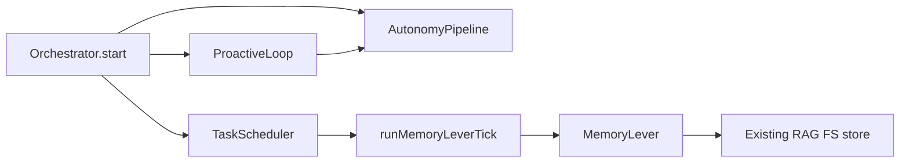
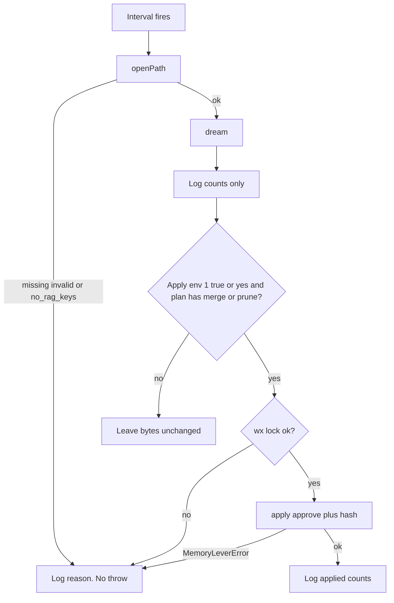

# DTE Orchestrate Continual Learning - Plan

## Goal Capsule

- **Objective:** Compose Deep Tree Echo orchestration with continual learning: the daemon attaches one ProactiveLoop instance, schedules MemoryLever RAG hygiene when a filesystem RAG store already exists, and AGENTS.md documents the operator and agent path.
- **Authority:** This plan is the source of truth. Product behavior lives on R-IDs. Mechanism lives on KTDs. Units cite those IDs and do not restate them.
- **Execution profile:** Last-mile wiring of shipped libraries. Do not write a second memory engine or a second proactive engine.
- **Stop conditions:** Stop if the work would rewrite AutonomyPipeline, replace LLM `runConsolidation`, unify frontend RAG settings JSON with filesystem, invent an MCP, mutate VectorMemoryStore, or auto-apply without an env grant.
- **Tail ownership:** `ce-work` implements U1–U4. Orchestrator Jest is the merge gate. Electron and headed Live2D are not required.

---

## Product Contract

### Summary

MemoryLever and TaskScheduler already exist. ProactiveLoop already exists. None of them are composed. `pnpm start:orchestrator` alone still registers no hygiene task and starts no ProactiveLoop. Scheduled dream mutates only an existing filesystem RAG store (`deepTreeEchoBotMemories`), not VectorMemoryStore and not desktop settings JSON. Default ticks are dry-run. Agents who read AGENTS.md do not learn the storage-path contract or the dual consolidation paths. This plan wires those pieces and writes the missing ops guidance.

### Problem Frame

August plans shipped the desktop proactive loop and the memory-lever CLI as separate products. Their deferred tails named orchestrator MemoryLever scheduling and a later 24/7 DeltaChat send loop. Scheduling is still unwired, so RAG hygiene never runs unless a human invokes `pnpm memory:lever`. ProactiveLoop is never constructed. This slice closes scheduling plus loop attach. It does not send DeltaChat messages and does not hygiate the autonomy vector arena. January integration task lists still look like a backlog and will mis-route work toward packages that already exist.

### Requirements

**Heartbeat**

- R1. When `enableAutonomy` is true and AutonomyPipeline starts, the daemon constructs one `ProactiveLoop`, starts it, and passes it to `AutonomyPipeline.setProactiveLoop`. This is process liveness of that loop, not outbound DeltaChat send.
- R2. Orchestrator `stop()` stops that loop before it stops AutonomyPipeline.
- R3. ProactiveLoop INTEGRATE does not call MemoryLever. LLM `runConsolidation` stays unchanged.

**Scheduled hygiene**

- R4. When `enableScheduler` is true and `DELTECHO_AUTONOMY_STORAGE_PATH` is a non-empty path, the scheduler registers one interval task named `memory-lever-dream`.
- R5. An empty or unset `DELTECHO_AUTONOMY_STORAGE_PATH` skips registration. No interval task is created.
- R6. Each tick opens the existing store through `MemoryLever.openPath` and runs `dream()` with library defaults. The path must already contain live RAG key `deepTreeEchoBotMemories`. Vector-only directories and missing RAG keys skip with reason `no_rag_keys` and do not apply.
- R7. Dry-run is the default. Storage bytes stay unchanged unless R8 applies.
- R8. Apply runs only when `DELTECHO_MEMORY_LEVER_APPLY` is exactly `1`, `true`, or `yes` (case-insensitive) and the dream plan has at least one merge or prune. Unset, empty, and any other value are dry-run. The grant is standing for later ticks, is read only from the orchestrator process environment, and authorizes full library apply (merge and prune tombstones). If `envFlag` is reused, its fallback must be false. Apply uses library `approve: true` and the plan hash from that same tick.
- R9. `MemoryLeverError`, missing store, invalid JSON, `no_rag_keys`, and lock contention fail only that tick. The scheduler stays running. The next interval may retry. The tick never creates a store directory or RAG JSON file.
- R10. Interval default is 6 hours. `DELTECHO_MEMORY_LEVER_INTERVAL_MS` overrides it. Values below 60 seconds clamp to 60 seconds. Non-numeric values fall back to 6 hours.

**Observability and guidance**

- R11. Logs may record task name, ids, counts, reason codes, and paths only. They must never include memory text, packed context, survivor text, plan body, sender, or chatId.
- R12. AGENTS.md documents daemon start, `pnpm memory:lever`, `DELTECHO_AUTONOMY_STORAGE_PATH`, the apply env (standing grant; default dry-run), the 6-hour default, unset-path skip, RAG-only store requirement, dual proactive systems, dual consolidation paths, the frontend-vs-filesystem store split, and that library apply leaves `*.json.bak-*` snapshots with full pre-apply memory text that this slice does not expire.

### Actors

- A1. Operator running `pnpm start:orchestrator`.
- A2. Coding agent using AGENTS.md or `pnpm memory:lever`.
- A3. Existing filesystem RAG store at `DELTECHO_AUTONOMY_STORAGE_PATH` (conversation text, sender, and chatId). OS file ownership is the store authorization model. This slice does not chmod live RAG JSON.

### Key Flows

- F1. Heartbeat attach
  - **Trigger:** Orchestrator start with `enableAutonomy`.
  - **Actors:** A1
  - **Steps:** Start AutonomyPipeline. Construct ProactiveLoop. Start loop. `setProactiveLoop`.
  - **Outcome:** Loop `running` is true. Pipeline holds the same instance. No DeltaChat send is required.
- F2. Dry-run hygiene
  - **Trigger:** Scheduler due time with a valid store path.
  - **Actors:** A1, A3
  - **Steps:** Open path. Dream. Log counts. Do not apply.
  - **Outcome:** Store bytes unchanged.
- F3. Gated apply
  - **Trigger:** F2 plus truthy apply env and a non-empty merge/prune plan.
  - **Actors:** A1, A3
  - **Steps:** Apply with approve and that tick's hash. Log applied counts only.
  - **Outcome:** Library apply audit. Contradictions stay live.
- F4. Skip and survive
  - **Trigger:** Missing store, `no_rag_keys`, invalid JSON, or lock held.
  - **Actors:** A1
  - **Steps:** Log reason code. Do not throw out of the scheduler.
  - **Outcome:** Daemon stays up. No new files from a missing-store skip.
- F5. Unset path
  - **Trigger:** Orchestrator start with scheduler on and storage path unset or empty.
  - **Actors:** A1
  - **Steps:** Do not register `memory-lever-dream`.
  - **Outcome:** Zero hygiene tasks. Daemon stays up.

### Acceptance Examples

- AE1. Covers R1, R2. Given autonomy enabled, when start then stop run, then one ProactiveLoop was started and later stopped, and `setProactiveLoop` received that instance.
- AE2. Covers R4, R6, R7, R11. Given a fixture store with two near-duplicate memories and apply env unset, when the tick runs, then dream counts include one merge group, storage bytes are unchanged, and logs contain no memory text.
- AE3. Covers R9, F4. Given a path that does not exist, when the tick runs, then no directory is created and the handler does not throw.
- AE4. Covers R8. Given AE2's store and apply env `1`, when the tick runs, then apply uses approve plus the dream hash, losers are tombstoned, and a second dream of those ids has no merge.
- AE5. Covers R8. Given apply env `1` and a store with no merge or prune candidates, when the tick runs, then `apply` is not called.
- AE6. Covers R12. Given the updated AGENTS.md, when an agent searches for memory lever or orchestrator start, then daemon start, `pnpm memory:lever`, `DELTECHO_AUTONOMY_STORAGE_PATH`, the apply env, the 6-hour default, unset-path skip, RAG-only store requirement, dual proactive systems, dual consolidation paths, the store split, and snapshot residue are present.
- AE7. Covers R5, F5. Given scheduler enabled and storage path unset, when start runs, then `memory-lever-dream` is not registered.
- AE8. Covers R6, F4. Given a directory with `vectorMemoryStore_memories` and no live `deepTreeEchoBotMemories`, when the tick runs, then it logs `no_rag_keys`, does not apply, and does not throw.

### Success Criteria

- Orchestrator Jest for U1 and U3 is green.
- A reviewer can rerun AE2 (dry-run unchanged bytes) and AE4 (apply tombstones) against a temp RAG fixture.
- AE7 and AE8 pass: unset path does not register; vector-only directories skip with `no_rag_keys`.
- AGENTS.md contains every R12 topic.

### Scope Boundaries

**In scope**

- Orchestrator start/stop wiring for one ProactiveLoop (process liveness only).
- Scheduled MemoryLever dream/apply on an existing filesystem RAG store at `DELTECHO_AUTONOMY_STORAGE_PATH`.
- AGENTS.md DTE ops for this composition.
- CHANGELOG operator note.

**Out of scope**

- Desktop settings JSON export into the autonomy directory.
- DeltaChatAutonomyBridge construction.
- Replacing LLM `runConsolidation`.
- MCP tools, Live2D, legacy IncomingMsg bot path, renderer queue persistence.

<!-- ce-section: work-relationships -->

### Work Relationships

This plan owns daemon composition of shipped ProactiveLoop and MemoryLever plus durable agent guidance.

- **Depends on:** `docs/plans/2026-08-21-001-feat-dte-memory-lever-plan.md` (library contract R1–R22) and existing `TaskScheduler` / `ProactiveLoop`.
- **Enables later:** desktop store export onto the lever path; orchestrator 24/7 DeltaChat proactive send loop.
- **Independent of:** desktop renderer `ProactiveMessaging` (`docs/plans/2026-08-24-001-feat-desktop-proactive-messaging-plan.md`).

### Deferred to Follow-Up Work

- Export or migrate frontend `deepTreeEchoBotMemories` settings JSON to a filesystem store the lever can open.
- Construct `DeltaChatAutonomyBridge` and schedule `checkProactiveMessage`.
- Stale `.lock` PID break on MemoryLever apply.
- Verify FileSystemStorage write errors instead of swallowed saves.
- Auto-update AGENTS.md from dream output.

---

## Planning Contract

### Key Technical Decisions

- KTD1. Call the shipped MemoryLever library from a new orchestrator helper. Do not shell out to `bin/dte-memory-lever.ts`. Governs R6–R8.
- KTD2. Register hygiene on TaskScheduler, not inside ProactiveLoop INTEGRATE. Loop cadence is seconds. Dream cadence is hours. Governs R3, R4, R10.
- KTD3. Extract `runMemoryLeverTick` and `registerMemoryLeverSchedule` so tests do not construct the full Orchestrator. Governs R4–R9.
- KTD4. Import MemoryLever from `deep-tree-echo-core/memory/node`. Governs R6.
- KTD5. Apply env is a standing process-local grant. Only `1`, `true`, and `yes` enable apply. Re-dream each tick. Do not reuse a prior plan file. Governs R8.
- KTD6. Missing store, missing RAG keys, and mkdir-refusal are tick skips, matching MemoryLever AE6. Unset path is a registration skip (R5), not an F4 tick. Governs R6, R9.
- KTD7. AGENTS.md is the continual-learning sink for this slice. Dream output does not write the repo. Governs R12.
- KTD8. Start ProactiveLoop only after a successful AutonomyPipeline start inside the existing `enableAutonomy` block. Governs R1.
- KTD9. On the apply path, take the exclusive sibling `.lock` with `open(..., "wx", 0o600)` as in `bin/dte-memory-lever.ts`, pass it as `beforeMutate`, and unlink after apply. Exclusive-create failure logs `locked` and returns. Governs R9.

### High-Level Technical Design

Component topology:

Tick gates:

Registration is a separate gate: empty or unset path never creates the interval task (R5, F5).

### Assumptions

- Desktop settings JSON export is a later job. This slice hygiates only an existing filesystem RAG store that an operator already points at.
- `DeltaChatAutonomyBridge` stays deferred. Loop attach proves process liveness, not 24/7 send.
- ProactiveLoop can start with default config and empty perception handlers. That is attach, not a send loop.
- `docs/solutions/` does not exist. Prior plans and residual findings are the learning corpus.

### Implementation Constraints

- Use `getLogger`. No `console.log`.
- Rebuild `deep-tree-echo-core` before orchestrator type-check if core types are imported.
- Logs follow R11's closed allow list. Do not log memory text, sender, or chatId.
- Do not add `pnpm e2e` as a merge gate.

### Sequencing

U1 helper and tests first. U2 wires start/stop. U3 is the remaining orchestrator attach coverage. U4 writes AGENTS.md and CHANGELOG.

### Sources and Research

- `packages/orchestrator/src/orchestrator.ts` — scheduler start with zero production tasks; unused `autonomyBridge` field; AutonomyPipeline start without ProactiveLoop.
- `packages/orchestrator/src/scheduler/task-scheduler.ts` — `scheduleInterval`.
- `packages/orchestrator/src/proactive-loop.ts` — start/stop heartbeat.
- `packages/orchestrator/src/autonomy-pipeline.ts` — `setProactiveLoop`.
- `packages/core/src/memory/MemoryLever.ts` and `packages/core/src/memory/node.ts`.
- `docs/plans/2026-08-21-001-feat-dte-memory-lever-plan.md` — deferred orchestrator scheduling.
- `docs/plans/2026-08-24-001-feat-desktop-proactive-messaging-plan.md` — deferred 24/7 loop.
- `docs/residual-review-findings/cursor-dte-memory-lever-eb6f.md` — swallowed saves, stale lock.
- External web research was skipped. Local patterns are sufficient.

---

## Implementation Units

### U1. Memory lever schedule helper

- **Goal:** A testable tick and registrar implement R4–R11 without constructing Orchestrator.
- **Requirements:** R4, R5, R6, R7, R8, R9, R10, R11
- **Dependencies:** none
- **Files:** `packages/orchestrator/src/memory-lever-schedule.ts`, `packages/orchestrator/src/__tests__/memory-lever-schedule.test.ts`
- **Approach:**
  1. Export `runMemoryLeverTick` and `registerMemoryLeverSchedule` per KTD3 and KTD1.
  2. Registrar no-ops when path is missing. Clamp interval per R10.
  3. Tick uses `MemoryLever.openPath` then `dream`. Skip `no_rag_keys` per R6. Apply only per R8 and KTD5.
  4. Apply takes the CLI `wx` lock per KTD9. Catch `MemoryLeverError`. Log `code` only. Do not rethrow.
- **Execution note:** Write failing tests for AE2–AE5, AE8 before the helper.
- **Patterns to follow:** `packages/core/src/memory/__tests__/MemoryLever.fs.test.ts` temp-dir fixture. `TaskScheduler` tests for `scheduleInterval`.
- **Test scenarios:**
  - Covers AE2. Fixture with two near-duplicates, apply unset: merge count ≥ 1, byte-identical store.
  - Covers AE3. Missing directory: no mkdir, no throw.
  - Covers AE4. Apply env `1`: tombstones written, second dream has no same-id merge.
  - Covers AE5. Apply env `1` on a clean unique-memory store: apply not called.
  - Invalid JSON at the RAG key: tick does not throw.
  - Held `.lock`: apply env set, exclusive create fails, tick does not throw, store unchanged.
  - Covers AE8. Vector-only directory: `no_rag_keys`, no apply, no throw.
  - Interval `1000` clamps to 60000 on register.
  - Non-numeric interval env falls back to 6 hours.
  - Logs/spies never receive memory text, sender, or chatId.
- **Verification:** New orchestrator Jest file is green. Helper is importable from orchestrator start code.

### U2. Orchestrator heartbeat and schedule attach

- **Goal:** Start and stop compose the helper and one ProactiveLoop.
- **Requirements:** R1, R2, R3, R4
- **Dependencies:** U1
- **Files:** `packages/orchestrator/src/orchestrator.ts`
- **Approach:**
  1. After a successful AutonomyPipeline start, construct and start ProactiveLoop, then `setProactiveLoop` per KTD8.
  2. After the autonomy block, if the scheduler already exists, call `registerMemoryLeverSchedule` once when the path is non-empty.
  3. On stop, stop the loop before AutonomyPipeline per R2.
  4. Do not construct `DeltaChatAutonomyBridge`. Do not call MemoryLever from ProactiveLoop INTEGRATE per R3.
- **Patterns to follow:** Existing `enableAutonomy` try/catch. Existing reverse-order stop.
- **Test scenarios:** Covered by U3. This unit is wiring.
- **Verification:** `orchestrator.ts` references the helper and ProactiveLoop start/stop. Autonomy failure still does not throw the whole daemon.

### U3. Attach coverage

- **Goal:** Prove F1 and schedule attach without booting every orchestrator service.
- **Requirements:** R1, R2, R4, R5
- **Dependencies:** U2
- **Files:** `packages/orchestrator/src/__tests__/dte-composition.test.ts`
- **Approach:**
  1. Prefer testing a small attach helper over `Orchestrator.start` if start remains too heavy.
  2. Assert one loop start, one `setProactiveLoop` call, and one stop.
  3. Assert `registerMemoryLeverSchedule` is invoked with the env path when the scheduler exists.
- **Patterns to follow:** Existing orchestrator tests that mock collaborators rather than starting Dovecot/IPC/Sys6.
- **Test scenarios:**
  - Covers AE1. Attach then detach: loop started and stopped, pipeline received the same instance.
  - Scheduler present and path set: registrar called once with that path.
  - Covers AE7. Scheduler present and path unset: registrar not called.
- **Verification:** New or extended Jest file is green without a live DeltaChat RPC.

### U4. Agent guidance

- **Goal:** AGENTS.md and CHANGELOG teach the composed path.
- **Requirements:** R12
- **Dependencies:** U1, U2
- **Files:** `AGENTS.md`, `CHANGELOG.md`
- **Approach:**
  1. Add a Deep Tree Echo operations subsection under Cursor Cloud instructions covering every R12 topic, including snapshot residue and RAG-only store.
  2. Do not copy January integration task lists. Point at this plan and the two August plans.
  3. CHANGELOG notes scheduled dry-run hygiene and the apply env.
- **Test expectation:** none -- documentation. AE6 is a review check, not a Jest file.
- **Verification:** AGENTS.md contains every R12 topic listed in AE6.

---

## Verification Contract

| Gate       | Command                                                                              | Applies to | Done signal             |
| ---------- | ------------------------------------------------------------------------------------ | ---------- | ----------------------- |
| Lever tick | `pnpm --filter=deep-tree-echo-orchestrator test -- memory-lever-schedule`            | U1         | AE2–AE5 and AE8 encoded |
| Attach     | `pnpm --filter=deep-tree-echo-orchestrator test -- dte-composition`                  | U3         | AE1 and AE7 encoded     |
| Types      | `pnpm --filter=deep-tree-echo-orchestrator check:types` after core rebuild if needed | U1, U2     | `tsc` clean             |
| Guidance   | Read `AGENTS.md`                                                                     | U4         | AE6 topics present      |

Do not require `pnpm e2e` or a headed Electron session.

---

## Definition of Done

**Global**

- R1–R12 are each cited by at least one landed unit.
- No second memory engine. No MCP. No VectorMemoryStore apply. No frontend store migration.
- Abandoned experimental helpers are not left in `packages/orchestrator/src/`.

**Per unit**

- U1: dry-run default, gated apply, skip missing store and `no_rag_keys`, `wx` lock, no throw on lever errors.
- U2: ProactiveLoop start/stop and schedule registration in the daemon path.
- U3: AE1 and AE7 coverage without a full daemon boot.
- U4: AGENTS.md names every R12 topic.

---

## Appendix

Phase 1 skipped external web research: local MemoryLever, TaskScheduler, and ProactiveLoop patterns are established. Institutional `docs/solutions/` does not exist. Agent-native assessment: extend the existing scheduler and library; never TTY-only apply; never a new MCP; AGENTS.md is the agent-accessible ops surface.
