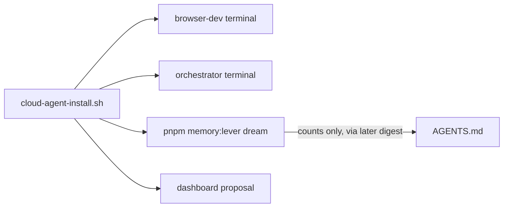

# Cloud Environment and DTE Continual Learning - Plan

## Goal Capsule

- **Objective:** Add an idempotent CI-order install script, propose dashboard `install` / `terminals` / `ports` backed by a tested draft build, and document cloud-ops facts proved on this VM. Dashboard Save is a human follow-up before later agents inherit named terminals. Learning in this slice is a reviewable AGENTS.md edit plus a ban on dream text, not a dream-to-repo writer.
- **Authority:** This plan is the source of truth. Product behavior lives on R-IDs. Mechanism lives on KTDs. Units cite those IDs and do not restate them.
- **Execution profile:** Environment composition and agent-ops guidance. Do not write a second memory engine, auto-write AGENTS.md from dream text, or commit a competing `.cursor/environment.json` that silently overrides the team dashboard environment.
- **Stop conditions:** Stop if the work would rewrite MemoryLever, construct `DeltaChatAutonomyBridge`, unify frontend RAG settings JSON with the filesystem store, invent an MCP, set `DELTECHO_MEMORY_LEVER_APPLY` in the baseline environment, or leak memory text into AGENTS.md, CHANGELOG, walkthrough artifacts, committed logs, or environment.json.
- **Tail ownership:** `ce-work` implements U1–U3, including snapshot, draft-build, and the environment proposal that records the tested `buildId`. Dashboard Save remains a human action after that proposal exists.

---

## Product Contract

### Summary

PR #44 already composed ProactiveLoop attach and scheduled MemoryLever hygiene. The team Cloud Agent environment only runs `pnpm install --frozen-lockfile` plus the internal package build chain. It has no `start`, no `terminals`, no browser port, and no documented cloud demo for the compose path. Default `pnpm start:orchestrator` dies on this VM because Dovecot Milter binds `/var/run/deep-tree-echo/milter.sock`. Agents who boot a fresh VM cannot start the real UI or the daemon without those facts. Continual learning stays a reviewable AGENTS.md edit, not an autonomous dream-to-repo write.

### Problem Frame

The create-environment workflow needs a VM that can install twice, start the browser target over HTTP, start the orchestrator without Dovecot Milter, and prove the shipped DTE compose contract (unset path skips `memory-lever-dream`; fixture dream is dry-run). AGENTS.md already lists compose-plan R12 topics from `docs/plans/2026-08-24-002-feat-dte-orchestrate-learn-plan.md`. It does not yet name the cloud install script, the Dovecot disable required to start the daemon, the named terminals that appear only after dashboard Save, or the read-only fixture dream command. Auto-updating AGENTS.md from `DreamPlan.survivorText` remains deferred because it would violate compose-plan KTD7.

### Requirements

**Environment bootstrap**

- R1. An idempotent install script at `scripts/cloud-agent-install.sh` refreshes dependencies with `pnpm install --frozen-lockfile` and builds internal TS packages in CI order: `deep-tree-echo-core`, `@deltecho/sys6-triality`, `@deltecho/dove9`, `@deltecho/ipc`, `@deltecho/cognitive`, `deep-tree-echo-orchestrator`.
- R2. The install script terminates. It does not start the browser server, orchestrator, or any other long-running process.
- R3. Running the install script twice in a row succeeds without rewriting the lockfile.
- R4. Proposed Cloud Agent `install` invokes that script. Proposed `terminals` include `browser-dev` (`USE_HTTP_IN_TEST=true WEB_PORT=3000 WEB_PASSWORD=cloud-dev pnpm start:browser`) and `orchestrator` (`DEEP_TREE_ECHO_ENABLE_DOVECOT=false pnpm start:orchestrator`). Proposed `ports` expose 3000 as the browser UI. The proposal is backed by a successful snapshot and draft environment build that records the tested `buildId`.
- R5. Baseline proposed environment does not set `DELTECHO_AUTONOMY_STORAGE_PATH` or `DELTECHO_MEMORY_LEVER_APPLY`. Unset path keeps scheduled hygiene unregistered. Apply stays dry-run unless an operator exports a grant in their own session.

**Runtime demonstration**

- R6. `browser-dev` uses `USE_HTTP_IN_TEST=true` and documented `WEB_PASSWORD=cloud-dev`. It must not set `NODE_ENV=test`, which would serve `test.html` instead of `main.html`. `pnpm start:browser` owns the frontend build cost.
- R7. `orchestrator` starts with `DEEP_TREE_ECHO_ENABLE_DOVECOT=false` so Milter does not bind `/var/run/deep-tree-echo/milter.sock`. Webhook default is 8080 from `WebhookServer` DEFAULT_CONFIG; `DEEP_TREE_ECHO_WEBHOOK_PORT` is comment-only in `daemon.ts` and is not required for browser port 3000.
- R8. With storage path unset, orchestrator start remains successful and does not register `memory-lever-dream`.
- R9. Against a temp filesystem RAG fixture that already contains live key `deepTreeEchoBotMemories`, `pnpm memory:lever dream --storage-path <temp>` leaves store bytes unchanged. Verification evidence may record counts, reason codes, and hash only. Full DreamPlan JSON including `survivorText` stays on the local tty.

**Continual learning**

- R10. AGENTS.md remains the continual-learning sink. New durable, non-obvious cloud facts from this slice are written there by a human or agent PR, not by MemoryLever apply.
- R11. AGENTS.md documents: the cloud install script; the proposed `browser-dev` and `orchestrator` terminal commands; that those named terminals do not exist until a human Saves the dashboard proposal and until then agents start the same processes via the documented commands; Dovecot disable as the daemon-start requirement; `USE_HTTP_IN_TEST` plus `WEB_PASSWORD=cloud-dev` without `NODE_ENV=test`; the read-only fixture dream command with `--storage-path`; and that dream output must not be copied into AGENTS.md.
- R12. Dream-derived text (survivor text, packed context, sender, chatId, plan body) never enters AGENTS.md, CHANGELOG, walkthrough artifacts, logs committed to the repo, or environment.json.

### Actors

- A1. Cloud Agent or operator validating the VM.
- A2. Human who Saves the proposed environment in the dashboard.
- A3. Existing filesystem RAG fixture used only for dry-run dream.

### Key Flows

- F1. Idempotent install
  - **Trigger:** Fresh checkout or repeat install.
  - **Actors:** A1
  - **Steps:** Run `scripts/cloud-agent-install.sh` twice.
  - **Outcome:** Both runs exit 0. Lockfile unchanged.
- F2. Browser hello-world
  - **Trigger:** `browser-dev` command or `pnpm start:browser` with the R6 env.
  - **Actors:** A1
  - **Steps:** `pnpm start:browser` builds then serves. Open login. Submit `cloud-dev`. Confirm `main.html` app chrome.
  - **Outcome:** Real UI, not the test harness.
- F3. Orchestrator compose skip
  - **Trigger:** Orchestrator command with Dovecot disabled and storage path unset.
  - **Actors:** A1
  - **Steps:** Start daemon. Observe start logs.
  - **Outcome:** Daemon stays up. No `memory-lever-dream` registration.
- F4. Fixture dream
  - **Trigger:** Operator or agent runs `pnpm memory:lever dream --storage-path <temp>` against a seeded temp store.
  - **Actors:** A1, A3
  - **Steps:** Seed `deepTreeEchoBotMemories.json`. Dream with `--storage-path`. Compare bytes. Record counts only.
  - **Outcome:** Store unchanged. AGENTS.md untouched. No survivor text in repo evidence.
- F5. Continual-learning edit
  - **Trigger:** A durable cloud caveat is confirmed during validation, or the prescribed R11 contract is written before that validation.
  - **Actors:** A1
  - **Steps:** Edit AGENTS.md. Do not paste dream JSON.
  - **Outcome:** Reviewable guidance. No memory text.
- F6. Dashboard proposal
  - **Trigger:** U3 evidence for F1–F4 exists.
  - **Actors:** A1, A2
  - **Steps:** A1 snapshots, draft-builds, and proposes install/terminals/ports with the tested `buildId`. A2 Saves.
  - **Outcome:** Later agents inherit named terminals only after Save.

### Acceptance Examples

- AE1. Covers R1, R2, R3. Given a completed first install, when the script runs again, then it exits 0 and `pnpm-lock.yaml` is byte-identical.
- AE2. Covers R6, F2. Given `USE_HTTP_IN_TEST=true` and `WEB_PASSWORD=cloud-dev`, when a client logs in at `http://localhost:3000`, then the response is the real app (`main.html` path), not `test.html`.
- AE3. Covers R7, R8, F3. Given Dovecot disabled and storage path unset, when the orchestrator starts, then it stays up and does not register `memory-lever-dream`.
- AE4. Covers R9, F4. Given a temp RAG fixture with two near-duplicate memories, when `pnpm memory:lever dream --storage-path <temp>` runs, then the fixture bytes are unchanged and recorded evidence contains counts only.
- AE5. Covers R10, R11, R12, F5. Given the updated AGENTS.md, when an agent searches for cloud install, terminals, Dovecot disable, Save caveat, or fixture dream, then those topics are present and no memory text appears.
- AE6. Covers R4, F6. Given successful local install and demo evidence, when the environment is proposed, then the proposal includes `install` pointing at the script, the two terminal commands, port 3000, and the tested draft `buildId`.

### Success Criteria

- Install script passes AE1 on this VM.
- Browser login passes AE2.
- Orchestrator start passes AE3.
- Fixture dream passes AE4.
- AGENTS.md contains every R11 topic and no R12-forbidden text.
- Snapshot plus draft environment build succeed; proposal includes the tested `buildId` (AE6). Dashboard Save remains human.

### Scope Boundaries

**In scope**

- `scripts/cloud-agent-install.sh` and a root `package.json` convenience script if one already-patterned script field is the local convention.
- AGENTS.md and CHANGELOG operator notes for cloud terminals and gated learning.
- Proposed dashboard `install` / `terminals` / `ports`. This slice does not commit `.cursor/environment.json`.
- Demonstration of shipped DTE compose (tests plus live start), not a rewrite of that compose.

**Out of scope**

- Auto-update AGENTS.md from `DreamPlan` text.
- `DeltaChatAutonomyBridge` and outbound send.
- Frontend settings JSON export onto the lever path.
- Electron/xvfb as the default cloud path.
- Standing apply grant in the environment baseline.
- MCP tools.

<!-- ce-section: work-relationships -->

### Work Relationships

This plan owns Cloud Agent environment composition and the continual-learning sink for cloud-ops facts.

- **Depends on:** `docs/plans/2026-08-24-002-feat-dte-orchestrate-learn-plan.md` (shipped compose) and `docs/plans/2026-08-21-001-feat-dte-memory-lever-plan.md` (library contract).
- **Enables later:** repo-managed `.cursor/environment.json` if the team chooses to override dashboard precedence; automated dream-count digest promotion into AGENTS.md.
- **Independent of:** desktop renderer `ProactiveMessaging`.

### Deferred to Follow-Up Work

- Auto-update AGENTS.md from sanitized dream counts (never survivor text).
- Stale `.lock` PID break and FileSystemStorage write-error verify (residuals from PRs #39 and #44).
- Commit `.cursor/environment.json` only if the team explicitly wants repository precedence over the dashboard environment.

---

## Planning Contract

### Key Technical Decisions

- KTD1. Keep the Cloud Agent environment dashboard-managed. Propose install/terminals/ports via the environment panel. Do not commit `.cursor/environment.json` in this slice, because a committed file overrides the team environment. Governs R4.
- KTD2. Put dependency install and the six internal package builds in `scripts/cloud-agent-install.sh`. Put long-running servers in proposed `terminals`, not `install` or `start`. Governs R1, R2.
- KTD3. Browser terminal is `USE_HTTP_IN_TEST=true WEB_PORT=3000 WEB_PASSWORD=cloud-dev pnpm start:browser`. The password is a single-tenant Cloud Agent local gate, not a secret. Proposed `ports: [3000]` assumes owner-only or Cursor-authenticated ingress. Do not reuse this password or HTTP mode for a shared or internet-facing deploy. Governs R6.
- KTD4. Orchestrator terminal exports `DEEP_TREE_ECHO_ENABLE_DOVECOT=false` and leaves autonomy storage unset. Webhook disable is optional; default webhook port is 8080, not 3000. Governs R5, R7, R8.
- KTD5. Continual learning is a PR edit to AGENTS.md. Dream JSON may appear on the local tty. Repo and walkthrough evidence record counts, reason codes, and hash only. Governs R10, R12.
- KTD6. Reuse shipped orchestrator Jest as the compose-plan regression gate. Do not add `pnpm e2e` as a merge gate. Governs demonstration of the already-landed compose-plan U1–U3 from `docs/plans/2026-08-24-002-feat-dte-orchestrate-learn-plan.md`.
- KTD7. Product Contract preservation relative to the shipped compose plan: unchanged for compose-plan R1–R12. This artifact adds a new Cloud/learn contract and does not reopen apply, lock, or store-split decisions.

### High-Level Technical Design

This slice writes prescribed R11 facts into AGENTS.md by PR. It does not promote live dream counts into AGENTS.md.

### Assumptions

- The current team install already matches the CI package build order and is a safe baseline to wrap.
- Node 20+ and pnpm 9.15.0 are present on the Cloud Agent image.
- Egress is unrestricted for this environment, so chatmail onboarding is possible but not required for this slice.
- `docs/solutions/` still does not exist. Residuals and August plans remain the learning corpus.
- DeltaChat connect failures are non-fatal. Dovecot start is fatal, which is why R7 disables it.

### Implementation Constraints

- Use `getLogger` if any new TypeScript is added. This slice prefers a shell script and markdown.
- Do not add secrets to environment.json, the install script, or AGENTS.md.
- Guard the install script so it is safe if invoked from a checkout that lacks a later file: it may only call commands that already exist on main.
- Rebuild workspace packages inside the install script even when `node_modules` exists.
- The install script must start with `#!/usr/bin/env bash` and `set -euo pipefail`.

### Sequencing

U1 lands the install script. U2 documents the prescribed R11 contract, including facts already known from this plan (Dovecot disable, terminal commands, Save caveat). U3 verifies F1–F4 live, then performs snapshot, draft-build, and proposal (F6). A later AGENTS.md edit covers any new durable caveat found in validation (F5).

### Sources and Research

- `AGENTS.md` — existing cloud and DTE ops contract.
- `packages/orchestrator/src/dovecot-interface/index.ts` — Milter default `/var/run/deep-tree-echo/milter.sock`; start rethrows.
- `packages/orchestrator/src/webhooks/webhook-server.ts` — DEFAULT_CONFIG.port is 8080.
- `packages/orchestrator/src/bin/daemon.ts` — `DEEP_TREE_ECHO_WEBHOOK_PORT` is documented but unused.
- `packages/orchestrator/src/dte-composition.ts` and `memory-lever-schedule.ts` — shipped compose.
- `packages/target-browser/package.json` — `start` builds then serves; `start:server` requires prior dist.
- `docs/plans/2026-08-24-002-feat-dte-orchestrate-learn-plan.md` — compose-plan KTD7 forbids dream writing the repo.
- `docs/residual-review-findings/cursor-dte-orchestrate-learn-1eef.md` — AutonomyPipeline mkdir residual.
- External web research was skipped except the public environment schema. Local patterns are sufficient.
- Slack tools were detected. Organizational Slack search was not requested.

---

## Implementation Units

### U1. Cloud install script

- **Goal:** One idempotent command prepares workspace dependencies and generated types.
- **Requirements:** R1, R2, R3
- **Dependencies:** none
- **Files:** `scripts/cloud-agent-install.sh`
- **Approach:**
  1. Shebang `#!/usr/bin/env bash` and `set -euo pipefail`.
  2. `pnpm install --frozen-lockfile`.
  3. Build the six internal packages in CI order.
  4. Do not call `pnpm build:browser` or any start command here; `pnpm start:browser` owns the frontend build.
- **Patterns to follow:** Current team environment install string. `.github/workflows/ci.yml` package order.
- **Test scenarios:**
  - Covers AE1. Second run exits 0. `git diff --exit-code pnpm-lock.yaml`.
  - Script contains no `pnpm start`, `start:webserver`, `start:browser`, or `start:orchestrator`.
- **Verification:** Two successful local runs. Lockfile unchanged.

### U2. Agent guidance

- **Goal:** AGENTS.md and CHANGELOG teach the cloud terminals and gated learning path.
- **Requirements:** R10, R11, R12
- **Dependencies:** U1
- **Files:** `AGENTS.md`, `CHANGELOG.md`
- **Approach:**
  1. Extend the Cursor Cloud section with the install script, proposed terminal commands, Dovecot disable, Save caveat, and fixture dream command with `--storage-path`.
  2. Keep the existing DTE operations block. Point at this plan plus the two August plans.
  3. CHANGELOG notes the cloud install script and that dashboard Save is still required for inherited terminals.
- **Test expectation:** none — documentation. AE5 is a review check.
- **Verification:** AGENTS.md contains every R11 topic and no memory text.

### U3. Environment demonstration and proposal

- **Goal:** Prove F1–F4 on this VM and complete F6 (snapshot, draft-build, propose).
- **Requirements:** R4, R5, R6, R7, R8, R9
- **Dependencies:** U1, U2
- **Files:** none required in the repo. Evidence lives in command output and walkthrough artifacts that contain no dream survivor text.
- **Approach:**
  1. Run U1 twice.
  2. Run shipped orchestrator Jest for `memory-lever-schedule` and `dte-composition` (compose-plan AE1, AE2, AE7, AE8).
  3. Start `USE_HTTP_IN_TEST=true WEB_PORT=3000 WEB_PASSWORD=cloud-dev pnpm start:browser`. Log in. Confirm real UI.
  4. Start `DEEP_TREE_ECHO_ENABLE_DOVECOT=false pnpm start:orchestrator`. Confirm AE3.
  5. Seed a temp RAG fixture and run dry-run dream with `--storage-path` (AE4). Record counts only.
  6. Snapshot the install-ready VM, trigger a draft build with the proposed `environmentJson`, and propose with that `buildId`.
- **Patterns to follow:** `packages/orchestrator/src/__tests__/memory-lever-schedule.test.ts` fixture shape.
- **Test scenarios:** AE1–AE4 and AE6 executed, not only documented.
- **Verification:** Command evidence plus a browser screenshot or recording of login. Proposal exists with tested `buildId`.

---

## Verification Contract

| Gate | Command | Applies to | Done signal |
| --- | --- | --- | --- |
| Install twice | `./scripts/cloud-agent-install.sh` | U1 | AE1 |
| Compose-plan tests | `pnpm --filter=deep-tree-echo-orchestrator test -- memory-lever-schedule dte-composition` | U3 | compose-plan AE1, AE2, AE7, AE8 stay green |
| Browser | `USE_HTTP_IN_TEST=true WEB_PORT=3000 WEB_PASSWORD=cloud-dev pnpm start:browser` | U3 | AE2 |
| Orchestrator | `DEEP_TREE_ECHO_ENABLE_DOVECOT=false pnpm start:orchestrator` | U3 | AE3 |
| Fixture dream | `pnpm memory:lever dream --storage-path <temp>` | U3 | AE4 counts only |
| Guidance | Read `AGENTS.md` | U2 | AE5 |
| Proposal | snapshot + draft build + propose | U3 | AE6 |

Do not require `pnpm e2e` or headed Electron.

---

## Definition of Done

**Global**

- R1–R12 are each cited by at least one landed unit.
- No committed `.cursor/environment.json`.
- No apply grant in baseline environment.
- No dream text in the repo.

**Per unit**

- U1: script exists, idempotent, no servers.
- U2: AGENTS.md names every R11 topic.
- U3: AE1–AE4 have runtime evidence and AE6 has a proposal with tested `buildId`.

---

## Appendix

Phase 1 skipped external web research except fetching the public environment schema to confirm `install`, `start`, `terminals`, and `ports` fields. Institutional `docs/solutions/` does not exist. Agent-native assessment: keep AGENTS.md as the reviewable sink; do not invent MCP; do not auto-apply memory or auto-write the repo from dream.

Doc review (non-interactive, 2026-08-24): applied P0/P1 fixes for fatal Dovecot Milter bind, retracted the false webhook-port-3000 collision, pinned `pnpm start:browser`, required `--storage-path`, owned snapshot/proposal on U3, restricted dream evidence to counts, and documented the human Save caveat.
