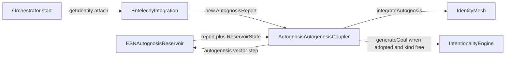
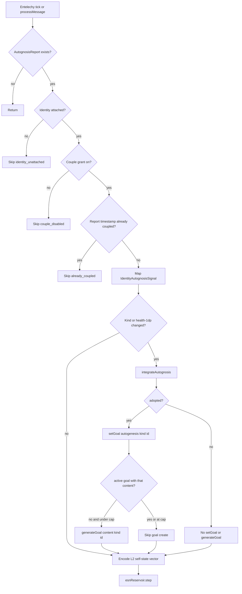

# DTE Autognosis Autogenesis Loop - Plan

## Goal Capsule

- **Objective:** On the live Entelechy tick, a new autognosis report can update attached CoreSelf identity (AAR traits and intrinsic goals), and the resulting self-state is observed by the reservoir as one L2-normalized numeric vector. This slice does not require the next `AutognosisReport` field to change.
- **Authority:** This plan is the source of truth. Product behavior lives on R-IDs. Mechanism lives on KTDs. Units cite those IDs and do not restate them.
- **Execution profile:** Last-mile coupling of shipped engines. Do not write a second reservoir, a second identity mesh, or an LLM goal generator.
- **Stop conditions:** Stop if the work would rewrite `ESNAutognosisReservoir.performAutognosis`, replace AAR voting in `IdentityMesh.integrateAutognosis`, invent an MCP, send DeltaChat messages, or change Live2D/avatar projection.
- **Tail ownership:** `ce-work` implements U1–U4. Verification Contract gates are the merge bar. Headed Electron and Live2D are not required.

---

## Product Contract

### Summary

Autognosis already exists as `AutognosisReport` on the ESN reservoir. Autogenesis already exists as AAR-governed trait evolution (`IdentityMesh.integrateAutognosis`) and intrinsic goal creation (`IntentionalityEngine.generateGoal`). Those surfaces are not composed. Entelechy ticks the reservoir and reads reports for visual and entelechy scores, but never calls `integrateAutognosis`. Generated goals never re-enter the reservoir. The daemon therefore has self-monitoring without self-generation, and self-generation APIs with no live driver. This slice wires both directions through one testable coupler and attaches it to the existing Entelechy background loop.

Product Contract preservation: new bootstrap (no upstream brainstorm).

### Problem Frame

`EntelechyIntegration.backgroundTick` already steps `esnReservoir`, reads `getAutognosisReport()`, and feeds health into `entelechyEngine.tick`. `IdentityMesh.integrateAutognosis` is covered only by unit tests. `CoreSelfEngine` owns a live `IdentityMesh` in the same daemon start path, one step before Entelechy starts, and never hands that identity to Entelechy. `IntentionalityEngine` creates foundational intrinsic goals at construction and then only reacts to inbound messages. The missing product is composition: a granted coupler can update that attached self from a new report, and the reservoir then observes an encoded self-state vector. Ambient keep-alive remains a separate low-amplitude step. The live driver is `backgroundTick`. `processMessage` is an existing API that must couple if called; this slice does not add a daemon caller for it.

### Requirements

**Autognosis to autogenesis**

- R1. When a new `AutognosisReport` is available, identity is attached, and the couple grant is on, the coupler maps report plus current `ReservoirState` into `IdentityAutognosisSignal`. It calls `IdentityMesh.integrateAutognosis` only when the report timestamp is new and the derived kind or health rounded to one decimal differs from the last integrated report. A new timestamp with unchanged kind and health still may run R5.
- R2. When that proposal is adopted, the coupler writes one identity goal via `IdentityMesh.setGoal` whose id is `autogenesis:<kind>` for kinds `edge-of-chaos`, `regulate`, or `recover-pathology`, and whose description is the proposal title, not user chat text.
- R3. When that proposal is adopted and active intentional goals are below the engine cap, the coupler calls `IntentionalityEngine.generateGoal` with `content` `autogenesis:<kind>`, `priority` equal to proposal consensus, `origin.source` `intrinsic`, `origin.reasoning` containing `autogenesis:<kind>`, and `origin.fromStates` `[]`. A later report of the same kind does not create a duplicate active goal.
- R4. When the proposal is not adopted, identity traits stay unchanged (existing AAR rule) and no new intrinsic goal is created.

**Autogenesis to autognosis**

- R5. After the autognosis-to-autogenesis pass, the coupler encodes attached identity traits, latest proposal consensus and risk, adopted boolean, and active intrinsic goals into a numeric vector of the reservoir `inputDim` and calls `esnReservoir.step` once. The step targets only the Entelechy `esnReservoir` singleton, not `CoreSelfEngine`'s `EchoReservoir`.
- R6. The feedback vector contains only numeric features (counts, priorities, progress, clamped traits, consensus, risk, health, adopted). It is L2-normalized the same way `EntelechyIntegration.encodeMessage` normalizes message input. It does not encode user message text. Reserved consensus and adopted slots must differ between an adopted AE1 fixture and a rejected AE4 fixture.
- R7. If identity is unattached, both directions no-op and return `identity_unattached`. If the couple grant is off, both directions no-op and return `couple_disabled`. The Entelechy loop stays running.

**Composition**

- R8. `EntelechyIntegration` runs the coupler on `backgroundTick` when a report exists (the live driver) and once after `processMessage` reservoir step when a report exists (existing API; this slice adds no daemon caller). A coupler throw is caught and logged on both sites; Entelechy stays running and `processMessage` still returns its existing result.
- R9. Orchestrator start constructs CoreSelf in its own try/catch. After a successful CoreSelf start it attaches `this.coreSelfEngine.getIdentity()` to Entelechy. A later Entelechy try still calls `entelechyIntegration.start()` when CoreSelf failed. The attached mesh is the one `IdentityMesh.generateSystemPrompt` already feeds to CoreSelf inference.
- R10. Coupler and Entelechy logs may record kind, adopted boolean, skip reason, counts, and hashes only. They must never include goal description text, proposal rationale, autognosis narrative, or user message text. `generateGoal` `content` is the kind id so existing engine debug lines stay inside the allowed token set.
- R12. Couple mutations (`integrateAutognosis`, `setGoal`, `generateGoal`, and the autogenesis `step`) run only when `DELTECHO_AUTOGENESIS_COUPLE` is exactly `1`, `true`, or `yes` (case-insensitive). Unset, empty, and any other value attach identity, log `couple_disabled`, and no-op both directions. Entelechy stays running. The grant is standing and process-local, matching the MemoryLever apply-grant shape.

**Observability**

- R11. AGENTS.md documents the coupling, the CoreSelf attach requirement, the unattached skip, the `couple_disabled` grant (`DELTECHO_AUTOGENESIS_COUPLE`, default off), the three proposal kinds, the kind-or-health integrate gate, and that this loop is independent of MemoryLever dream and of desktop `ProactiveMessaging`.

### Actors

- A1. Operator running the orchestrator daemon.
- A2. Coding agent using AGENTS.md.
- A3. Attached `IdentityMesh` from `CoreSelfEngine` (process-local identity, not a filesystem RAG store).

### Key Flows

- F1. Closed loop on a live report
  - **Trigger:** Entelechy `backgroundTick` (or `processMessage` if called) produces a new `AutognosisReport` timestamp while identity is attached and the couple grant is on.
  - **Actors:** A1, A3
  - **Steps:** Map signal. `integrateAutognosis` when kind or health-to-1dp changed. Adopted path writes identity goal `autogenesis:<kind>` and at most one intrinsic goal with that content. Encode L2-normalized self-state. `esnReservoir.step`.
  - **Outcome:** One AAR proposal recorded when integrate ran. Reservoir received one autogenesis vector. Same timestamp does not couple again.
- F2. Pathology defer
  - **Trigger:** Saturated or dead report that existing AAR rejects.
  - **Actors:** A3
  - **Steps:** `integrateAutognosis` returns `adopted: false`. Skip `setGoal` and `generateGoal`. Still run R5 feedback so the reservoir sees the rejected self-state.
  - **Outcome:** Traits unchanged. No new intrinsic goal. Feedback step still occurs.
- F3. Unattached or grant-off skip
  - **Trigger:** Entelechy running without identity attach, or `DELTECHO_AUTOGENESIS_COUPLE` unset/false.
  - **Actors:** A1
  - **Steps:** Coupler returns `identity_unattached` or `couple_disabled`. No `integrateAutognosis`. No reservoir autogenesis step.
  - **Outcome:** Existing Entelechy ambient step and visual snapshot continue.

### Acceptance Examples

- AE1. Covers R1, R2, R3, F1. Given grant on, a healthy edge-of-chaos report, and attached identity, when couple runs, then one adopted AAR proposal exists, identity has goal id `autogenesis:edge-of-chaos`, intentionality has one intrinsic goal whose content is `autogenesis:edge-of-chaos`, and `generateSystemPrompt` contains that id.
- AE2. Covers R1, R3. Given AE1 already ran, when the same report timestamp is coupled again, then no second `integrateAutognosis` call, no second intrinsic goal, and no second autogenesis `step`.
- AE3. Covers R1, R3. Given AE1 already ran and a later report with a new timestamp, the same kind, and health unchanged at one decimal, when couple runs, then `integrateAutognosis` is not called, `generateGoal` is not called, and R5 still runs.
- AE4. Covers R4, F2. Given grant on and a saturated low-health report, when couple runs, then `adopted` is false, identity autognosis trait is unchanged, no intrinsic goal is created, and `esnReservoir.step` still runs with the feedback vector.
- AE5. Covers R5, R6. Given any attached granted couple, when the autogenesis step runs, then `esnReservoir.step` is called with a vector of length `inputDim` whose L2 norm is 1 (or 0 if every feature is zero) and the call is not `encodeMessage` of user text.
- AE6. Covers R7, F3. Given identity unattached, when couple runs, then reason is `identity_unattached` and neither `integrateAutognosis` nor an autogenesis `step` occurs.
- AE7. Covers R9. Given CoreSelf started, when orchestrator wires Entelechy, then Entelechy receives that identity instance. Given CoreSelf missing, Entelechy still starts.
- AE8. Covers R11. Given updated AGENTS.md, when an agent searches for autognosis or autogenesis, then attach requirement, unattached skip, grant default-off, three kinds, kind-or-health gate, and independence from MemoryLever and desktop proactive messaging are present.
- AE9. Covers R12, F3. Given identity attached and grant unset, when couple runs, then reason is `couple_disabled` and neither `integrateAutognosis` nor an autogenesis `step` occurs.
- AE10. Covers R6. Given AE1's adopted vector and AE4's rejected vector, reserved consensus and adopted slots differ.

### Success Criteria

- Core Jest for the coupler encodes AE1–AE6, AE9, and AE10.
- Orchestrator or Entelechy Jest encodes AE7 attach/skip.
- AGENTS.md contains every R11 topic.
- CHANGELOG notes the closed couple and the default-off grant.
- No new LLM call, MCP, or Live2D change lands.

### Scope Boundaries

**In scope**

- A testable coupler in `deep-tree-echo-core`.
- Entelechy tick and message-path invocation.
- Orchestrator identity attach.
- AGENTS.md and CHANGELOG for this composition.

**Out of scope**

- Rewriting ESN autognosis math or AAR vote weights.
- LLM-authored goals.
- MemoryLever, filesystem RAG, or desktop settings JSON.
- DeltaChat send or `ProactiveLoop` INTEGRATE.
- Avatar / Live2D parameter mapping.
- Persisting coupler history to disk.

<!-- ce-section: work-relationships -->

### Work Relationships

This plan owns last-mile coupling of shipped autognosis and autogenesis surfaces inside the Entelechy composition.

- **Depends on:** existing `ESNAutognosisReservoir`, `IdentityMesh.integrateAutognosis`, `IntentionalityEngine.generateGoal`, `EntelechyIntegration`, and orchestrator `CoreSelfEngine` start.
- **Enables later:** persistence of AAR proposals across daemon restarts; optional operator inspection of couple reason codes.
- **Independent of:** MemoryLever scheduling (`docs/plans/2026-08-24-002-feat-dte-orchestrate-learn-plan.md`) and desktop `ProactiveMessaging` (`docs/plans/2026-08-24-001-feat-desktop-proactive-messaging-plan.md`).

### Deferred to Follow-Up Work

- Export AAR proposals or couple receipts to a durable store.
- Feed couple reason codes into webhook or telemetry dashboards.
- Unify `CoreSelfEngine` ownership if orchestrator and AutonomyPipeline both construct one.

### Outstanding Questions

- None blocking. Deferred questions live under Follow-Up Work.

---

## Planning Contract

### Key Technical Decisions

- KTD1. Put the loop in a new core helper `AutognosisAutogenesisCoupler`, not inside `ESNAutognosisReservoir` or `IdentityMesh`. Governs R1–R7.
- KTD2. Inject `IdentityMesh`, reservoir `step`/`getState`/`getAutognosisReport`, and intentionality `generateGoal`/`getActiveGoals` as constructor deps so tests do not construct Entelechy or the daemon. Default production deps may bind the existing singletons plus an attached identity. Governs R1, R3, R5, R7.
- KTD3. Dedupe on `AutognosisReport.timestamp` for couple re-entry (full skip, no integrate, no generateGoal, no autogenesis `step`). Dedupe `generateGoal` on active content `autogenesis:<kind>`. Call `integrateAutognosis` only when timestamp is new and kind or health rounded to one decimal differs from the last integrated report. Governs R1, R3.
- KTD4. Proposal kinds are a closed set derived from the report: `recover-pathology` when `isSaturated` or `isDead`, `edge-of-chaos` when `isEdgeOfChaos`, else `regulate`. Identity goal id and `generateGoal` content are `autogenesis:<kind>`. Governs R2, R3.
- KTD5. F2 still performs the autogenesis `step` after a rejected proposal so the reservoir observes unchanged traits plus rejection features. The step targets only Entelechy's `esnReservoir` singleton. Full skips are `identity_unattached`, `couple_disabled`, and `already_coupled`. Governs R4, R5, R7, R12.
- KTD6. Entelechy receives the coupler via constructor or setter and calls `couple()` only when `getAutognosisReport()` is non-null. Ambient `generateAmbientInput` stays as the keep-alive step and is not replaced. Governs R8.
- KTD7. Orchestrator wraps CoreSelf construct/start in its own try/catch, attaches `this.coreSelfEngine.getIdentity()` only after success, and still starts Entelechy in a later try when CoreSelf failed. Do not construct a second `IdentityMesh` for Entelechy. Governs R9.
- KTD8. Export `IdentityAutognosisSignal` and `IdentityGovernanceProposal` from `packages/core/src/core-self/index.ts` so the coupler can stay on public types. Governs R1.
- KTD9. AGENTS.md is the agent-facing sink. Couple output does not write the repo. Governs R11.
- KTD10. Couple grant env is `DELTECHO_AUTOGENESIS_COUPLE`. Only `1`, `true`, and `yes` enable mutations. Read from process env in the coupler. Governs R12.
- KTD11. L2-normalize the autogenesis vector the same way `encodeMessage` does. Reserved consensus and adopted slots differ between adopted and rejected fixtures. Governs R6.

### High-Level Technical Design

Component topology:

Couple gates:

Directional sketches are guidance, not signatures.

### Assumptions

- Headless bootstrap inferred that "autogenesis" means existing AAR trait evolution plus intrinsic `generateGoal`, not a new LLM or a new consciousness module.
- `IntentionalityEngine` remains a process singleton. Tests inject function deps rather than resetting the singleton.
- `AutognosisReport.timestamp` is stable for a given `performAutognosis` emission. A new report always carries a new timestamp.
- Dual `CoreSelfEngine` construction (orchestrator field vs AutonomyPipeline) is pre-existing. This slice attaches the orchestrator-owned instance only.
- Default-off couple grant matches MemoryLever apply-grant. Cloud baseline leaves the env unset.
- Attaching CoreSelf identity means adopted `setGoal` and AAR lines appear on the next `generateSystemPrompt`. That is accepted product behavior for this slice.
- `docs/solutions/` does not exist. Prior DTE composition plans are the learning corpus.

### Implementation Constraints

- Use `getLogger`. No `console.log`.
- Rebuild `deep-tree-echo-core` before orchestrator type-check.
- Logs follow R10. Do not log narratives, goal text, or user messages.
- Do not add `pnpm e2e` as a merge gate.
- Do not persist `*.json.bak-*` or identity files from this coupler.

### Sequencing

U1 coupler, types, and tests first. U2 wires Entelechy. U3 attaches identity from the daemon. U4 writes AGENTS.md and CHANGELOG.

### Sources and Research

- `packages/core/src/cognitive/ESNAutognosisReservoir.ts` — report shape, interval, internal spectral adapt, singleton `esnReservoir`.
- `packages/core/src/core-self/IdentityMesh.ts` — `integrateAutognosis`, `setGoal`, AAR adopt/defer.
- `packages/core/src/core-self/__tests__/IdentityMesh.autognosis.test.ts` — adopted vs pathological fixtures.
- `packages/core/src/consciousness/IntentionalityEngine.ts` — `generateGoal`, `getActiveGoals`, `MAX_ACTIVE_GOALS`.
- `packages/orchestrator/src/entelechy-integration.ts` — ambient step plus unread autognosis reports.
- `packages/orchestrator/src/orchestrator.ts` — CoreSelf then Entelechy start order.
- `docs/plans/2026-08-24-002-feat-dte-orchestrate-learn-plan.md` — last-mile composition pattern.
- External web research was skipped. Local patterns are sufficient. Research-agent substitution: in-thread (lost independent corroboration).

---

## Implementation Units

### U1. Autognosis-autogenesis coupler

- **Goal:** A testable coupler implements R1–R7, R12, and KTD1–KTD5, KTD8, KTD10, KTD11 without constructing Entelechy.
- **Requirements:** R1, R2, R3, R4, R5, R6, R7, R12
- **Dependencies:** none
- **Files:** `packages/core/src/core-self/AutognosisAutogenesisCoupler.ts`, `packages/core/src/core-self/__tests__/AutognosisAutogenesisCoupler.test.ts`, `packages/core/src/core-self/index.ts`
- **Approach:**
  1. Export `AutognosisAutogenesisCoupler` with injected identity, reservoir accessors, intentionality functions, and a grant reader per KTD2 and KTD10.
  2. `couple()` implements the gate diagram. Map report plus `ReservoirState` into `IdentityAutognosisSignal` per R1.
  3. Kind follows KTD4. Identity goal id and `generateGoal` content are `autogenesis:<kind>` per AE1.
  4. Feedback `step` L2-normalizes a numeric encoder per R5, R6, and KTD11. Unattached returns `identity_unattached`. Grant off returns `couple_disabled`.
  5. Export `IdentityAutognosisSignal` and `IdentityGovernanceProposal` per KTD8.
- **Execution note:** Write failing tests for AE1–AE6, AE9, and AE10 before the coupler body.
- **Patterns to follow:** `packages/core/src/core-self/__tests__/IdentityMesh.autognosis.test.ts` fixtures. Memory-lever helper style: no daemon in unit tests.
- **Test scenarios:**
  - Covers AE1. Grant on, healthy edge-of-chaos report: adopted proposal, identity goal `autogenesis:edge-of-chaos`, intrinsic goal content `autogenesis:edge-of-chaos`, `generateSystemPrompt` contains that id.
  - Covers AE2. Same timestamp: second couple does not call `integrateAutognosis`, `generateGoal`, or autogenesis `step`.
  - Covers AE3. New timestamp, same kind, health unchanged at one decimal: no `integrateAutognosis`, no `generateGoal`, R5 still runs.
  - Covers AE4. Saturated low-health report: not adopted, trait unchanged, no intrinsic goal, feedback `step` still called.
  - Covers AE5. Feedback vector length equals `inputDim`; L2 norm is 1 or 0; spy shows `step` was not given a user-text encoding.
  - Covers AE6. No identity: `identity_unattached`, no integrate, no autogenesis `step`.
  - Covers AE9. Grant unset: `couple_disabled`, no integrate, no autogenesis `step`.
  - Covers AE10. Adopted vs rejected reserved consensus and adopted slots differ.
  - Active goals already at cap: adopted path still `setGoal`, skips `generateGoal`.
  - `regulate` kind when not edge-of-chaos and not pathological.
  - Logs/spies never receive narrative, proposal rationale, or user text.
- **Verification:** New core Jest file is green. Types export from `core-self/index.ts`.

### U2. Entelechy couple invocation

- **Goal:** Live Entelechy ticks and message processing run the coupler when a report exists.
- **Requirements:** R8, R10
- **Dependencies:** U1
- **Files:** `packages/orchestrator/src/entelechy-integration.ts`, `packages/orchestrator/src/__tests__/entelechy-autogenesis.test.ts`
- **Approach:**
  1. Accept an injected or default coupler per KTD6. Expose `attachIdentity` that forwards to the coupler.
  2. After reservoir step in `backgroundTick` and `processMessage`, call `couple()` when a report exists. Wrap each call in try/catch that logs only R10 fields.
  3. Keep ambient keep-alive input. Do not replace it with the autogenesis vector.
  4. Log reason codes and adopted boolean only per R10.
- **Patterns to follow:** Existing Entelechy try/catch on background tick. Existing snapshot emit cadence.
- **Test scenarios:**
  - Injected coupler is invoked from the background-tick path when a report is present.
  - Injected coupler is invoked from `processMessage` when a report is present.
  - Missing report: coupler not invoked.
  - Coupler throw on the tick path is swallowed; Entelechy stays running.
  - Coupler throw on `processMessage` is swallowed; the existing `EntelechyProcessingResult` is still returned.
- **Verification:** New orchestrator Jest file is green without starting Dovecot or IPC.

### U3. Orchestrator identity attach

- **Goal:** Daemon start attaches the CoreSelf identity instance to Entelechy.
- **Requirements:** R9
- **Dependencies:** U2
- **Files:** `packages/orchestrator/src/orchestrator.ts`, `packages/orchestrator/src/__tests__/dte-autogenesis-attach.test.ts`
- **Approach:**
  1. Wrap CoreSelf construct/start in its own try/catch. After success, call `entelechyIntegration.attachIdentity(this.coreSelfEngine.getIdentity())` per KTD7.
  2. Start Entelechy in a later try that does not share CoreSelf's throw. If CoreSelf failed, skip attach and still start Entelechy.
  3. Prefer testing a small attach helper if `Orchestrator.start` remains too heavy.
- **Patterns to follow:** Existing Level 5 warn-and-continue. Existing composition tests that mock collaborators.
- **Test scenarios:**
  - Covers AE7. CoreSelf present: attach receives the same identity instance Entelechy later uses.
  - Covers AE7. CoreSelf absent: Entelechy start still happens, attach not called.
- **Verification:** New or extended orchestrator Jest file is green without a live DeltaChat RPC.

### U4. Agent guidance

- **Goal:** AGENTS.md and CHANGELOG teach the composed loop.
- **Requirements:** R11
- **Dependencies:** U1, U2, U3
- **Files:** `AGENTS.md`, `CHANGELOG.md`
- **Approach:**
  1. Add a short Deep Tree Echo operations note covering every R11 topic.
  2. Point at this plan. Do not copy January integration task lists.
  3. CHANGELOG notes the closed autognosis-autogenesis couple on Entelechy ticks and the default-off `DELTECHO_AUTOGENESIS_COUPLE` grant.
- **Test expectation:** none -- documentation. AE8 is a review check, not a Jest file.
- **Verification:** AGENTS.md contains every R11 topic listed in AE8. CHANGELOG mentions the couple and the grant.

---

## Verification Contract

| Gate | Command | Applies to | Done signal |
| --- | --- | --- | --- |
| Coupler | `pnpm --filter=deep-tree-echo-core test -- AutognosisAutogenesisCoupler` | U1 | AE1–AE6, AE9, AE10 encoded |
| Entelechy | `pnpm --filter=deep-tree-echo-orchestrator test -- entelechy-autogenesis` | U2 | Couple invoked on report, skipped without |
| Attach | `pnpm --filter=deep-tree-echo-orchestrator test -- dte-autogenesis-attach` | U3 | AE7 encoded |
| Types | Rebuild core, then `pnpm --filter=deep-tree-echo-orchestrator check:types` | U1–U3 | `tsc` clean |
| Guidance | Read `AGENTS.md` and `CHANGELOG.md` | U4 | AE8 topics present; CHANGELOG notes couple and grant |

Do not require `pnpm e2e` or a headed Electron session.

---

## Definition of Done

**Global**

- R1–R12 are each cited by at least one landed unit.
- No second reservoir, identity mesh, or LLM goal generator.
- Abandoned experimental helpers are not left in `packages/core/src/core-self/` or `packages/orchestrator/src/`.

**Per unit**

- U1: timestamp and kind-or-health dedupe, grant skip, adopt/defer, L2 feedback vector, AE10 slot difference.
- U2: Entelechy calls couple on report-bearing tick and message path; both sites swallow coupler throws.
- U3: Orchestrator attaches CoreSelf identity in a separate try, or starts Entelechy unattached when CoreSelf fails.
- U4: AGENTS.md names every R11 topic. CHANGELOG notes the couple and the grant.

---

## Appendix

Phase 0.7 headless scope draft: stated ask is a closed autognosis-autogenesis loop; inferred bet is last-mile coupling of ESN reports, AAR identity, and intrinsic goals on Entelechy; out of scope is a new cognitive engine, Live2D, MemoryLever, and DeltaChat send.

Phase 1 skipped external web research: local autognosis, AAR, intentionality, and Entelechy patterns are established. Institutional `docs/solutions/` does not exist. Agent-native assessment: extend the existing Entelechy composition; never TTY-only couple; never a new MCP; AGENTS.md is the agent-accessible ops surface.

Research-agent substitution: in-thread (lost independent corroboration).
