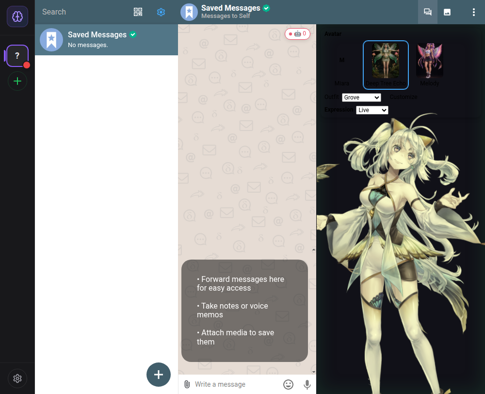
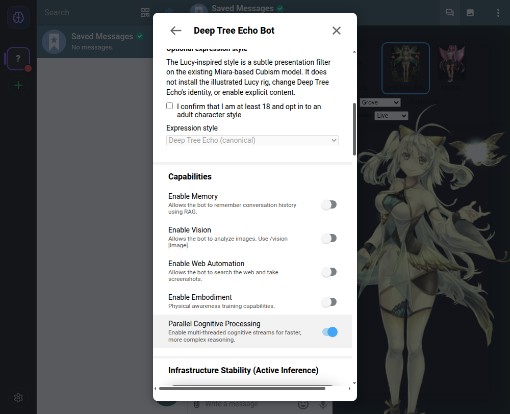

# Electron-first DTE embodiment: implementation and observed result

**5 October 2026.** Cloudflare implementation is paused. This change set concerns the Electron desktop, the private DTE daemon bridge, and the actual Cubism model. It does not install a Lucy GGUF, import a new Lucy Live2D rig, change DAO voting, or manufacture scientific evidence.

## Direct desktop observation

The built DeltEcho Electron app opened on the sandbox X11 display with a persistent, isolated `DC_TEST_DIR` profile. An existing local unconfigured account, the app's test navigation hook, and its Saved Messages option allowed the genuine chat pane to open **without accepting chatmail registration or sending an outbound message**. The bot setting mounted a **347 × 762 Cubism canvas**. Miara rendered, the Deep Tree Echo identity switched to the actual Miara-derived model, the named Smile expression changed the face, and two Live frames differed in 17.22% of the avatar crop over two seconds. The figure and its animation were visually observed; the supplied illustrated Lucy was not substituted for the rig.[1]

The renderer reported ANGLE SwiftShader in this sandbox. Its GPU-process CPU use was approximately 150% in the original software-rendering observation. The new Pixi ticker cap applies **only when the renderer reports a software WebGL backend**; hardware and unknown backends keep the original cadence. Classifier/unit tests and post-build Electron screenshots confirm correct path selection and continued rendering, but a controlled before/after power or CPU improvement was **not** measured. A hardware-accelerated Windows result must not be inferred from this X11 smoke.[1][2]

## Authoritative daemon path and revocation

The standalone daemon's documented `DEEP_TREE_ECHO_IPC_PATH` override had not reached `IPCServer`; Electron's broker also used the default endpoint. Both sides now accept the same validated private endpoint. The server rejects relative or malformed paths and refuses to unlink an unrelated file occupying the endpoint. The Electron main-process broker remains a **read-only, main-frame-only** `cognitive:get_state` projection with a bounded reply, request-ID check, and fail-closed null response; the app does not start a daemon.

The first live test discovered a second gap. Avatar polling had depended on a separate browser-side cognitive orchestrator that was **not initialized** by this Electron chat path. The mounted avatar now polls the optional Electron bridge directly, keeps an authoritative Entelechy lease separately from local fallback state, and revokes that lease when the daemon disappears. A real local daemon with chat/mail/webhooks/scheduler and other external integrations disabled returned an initialized core self and nonzero scientific, DAO, and ESN values to the **running Electron avatar**. After the actual socket-owning daemon process stopped, those authority-dependent values cleared in that still-open avatar:[3][4]

| Bounded visual field   | Daemon running, one observed sample | Daemon stopped, after poll |
| ---------------------- | ----------------------------------: | -------------------------: |
| `scientificGenius`     |                        0.6796204219 |                          0 |
| `daoConsensus`         |                        0.7401722964 |                          0 |
| `esnCoherence`         |                        0.4720554803 |                          0 |
| `coreSelf.initialized` |                                true |                      false |
| `predictiveCrystal`    |                                null |                       null |

These are **time-specific visual projection values**, not proof of an AGI capability or the validity of a conjecture. No predictive crystal appeared naturally during the smoke, and no fabricated event was injected into the screenshot. Origin checks remain source-level provenance, not cryptographic attestation against a compromised local daemon.[3][4]

The first direct `node dist/bin/daemon.js` attempt failed with `ERR_UNSUPPORTED_DIR_IMPORT` from a workspace ESM barrel. The daemon package's build/start/CLI now use an esbuild-produced `dist/bin/daemon.mjs`, while `tsc` still emits declarations. The production artifact was started with autonomy and all external integrations disabled; it bound a private socket, reported ready, and shut down cleanly on SIGTERM. The default autonomy setting was not changed, but `DEEP_TREE_ECHO_ENABLE_AUTONOMY=false` is available for bounded IPC-only smoke tests. The earlier live projection run used autonomy in a private in-memory daemon and was stopped; it was not an unattended service installation.

## Submitted character material and scope

The front/side/rear purple-winged character views are useful for silhouette and texture authoring. The supplied Lucy archive contains an **import PSD and an unrelated Hiyori `.moc3` demo**, not an exported Lucy/Neon Angel Cubism model. The separate Meshy FBX/GLB is a 3D route, not a Live2D rig; the supplied geometry audit does not establish facial morph channels. A real character-specific result still requires the artist-authored facial material split, native Cubism project, `.moc3`, `model3.json`, texture atlas, expressions/motions, and direct Electron model loading.[5][6]

Accordingly, the UI labels the new control as a **Lucy-inspired expression style** on the existing Miara-based Cubism model. It defaults to canonical, requires a local adult self-attestation and explicit opt-in, never unlocks explicit content, and is suppressed during scientific cues. The pure filter only makes small bounded parameter changes from actual positive affect; immutable non-harm, boundary-respect, and constructive-expression constraints cannot be edited. Revoking attestation resets the style immediately. A self-attestation is not independently verified age, and no Lucy inference backend or new rig is claimed. The rebuilt Electron settings modal visibly showed the unchecked attestation, disabled selector, and the honest model disclosure; no real user age claim was submitted.[7]

## Verification and remaining work

The observed runtime, private daemon response, and live revocation are stronger evidence than a static site or a compile. Focused tests cover the software-WebGL classifier, policy gating, local-setting sanitization, IPC path safety, and **daemon polling without a renderer orchestrator**. Repository `pnpm check`, all workspace package tests, the Electron production build, and the CI-mode browser E2E suite passed after the polling repair. Browser E2E reported **44 passed, 26 skipped**; skipped tests are not counted as passes. The installed/packaged **Windows** Electron application, hardware GPU performance, a complete new Lucy Cubism model, and a naturally occurring predictive-crystal animation remain unverified here. GitHub Pages stays a labelled static illustration rather than a Cubism proof.

[1]: ../evidence/2026-10-05-electron-dte-live.png "Direct Electron Cubism screenshot"
[2]: ../../packages/avatar/src/adapters/pixi-live2d-renderer.ts "Pixi renderer frame budget"
[3]: ../evidence/2026-10-05-avatar-daemon-on.json "Bounded live avatar projection"
[4]: ../evidence/2026-10-05-avatar-daemon-off.json "Observed authority revocation"
[5]: https://docs.live2d.com/en/cubism-editor-manual/psd-import/ "Live2D Cubism Editor PSD import"
[6]: https://docs.live2d.com/en/cubism-editor-manual/export-moc3-motion3-files/ "Live2D Cubism embedded-model export"
[7]: ../evidence/2026-10-05-electron-style-off.png "Real Electron opt-in settings screenshot"
